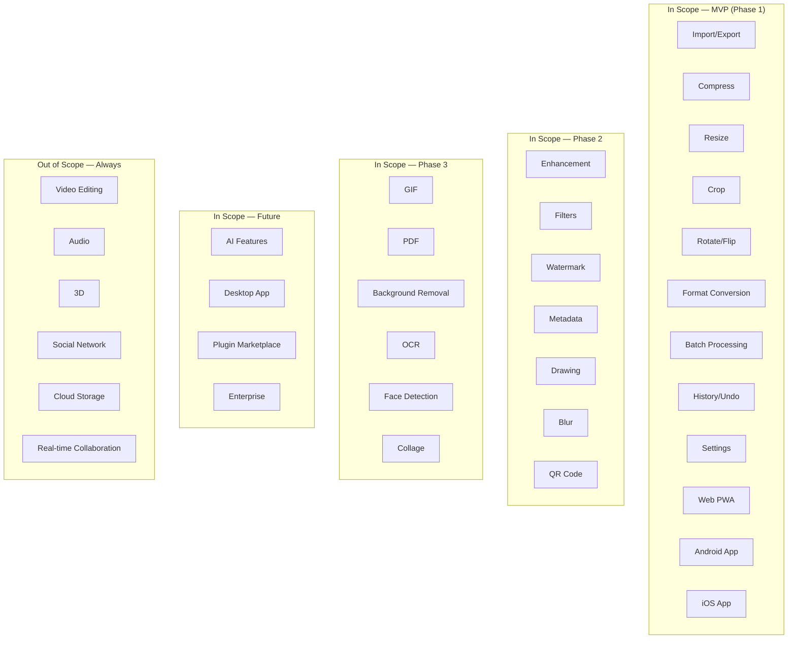

# Scope

> **Document ID**: 04
> **Phase**: 1 — Product Planning
> **Status**: Approved
> **Last Updated**: 2026-07-27
> **Owner**: Product Team

---

## Table of Contents

1. [Purpose](#1-purpose)
2. [Scope Overview](#2-scope-overview)
3. [In Scope — MVP](#3-in-scope--mvp)
4. [In Scope — Phase 2](#4-in-scope--phase-2)
5. [In Scope — Phase 3](#5-in-scope--phase-3)
6. [In Scope — Future Phases](#6-in-scope--future-phases)
7. [Explicitly Out of Scope](#7-explicitly-out-of-scope)
8. [Scope Change Process](#8-scope-change-process)
9. [Boundary Clarifications](#9-boundary-clarifications)
10. [Assumptions](#10-assumptions)
11. [Related Documents](#11-related-documents)

---

## 1. Purpose

This document defines the explicit boundaries of the ImageForge project — what is included, what is excluded, and the process for handling scope changes. Scope clarity prevents scope creep, guides resource allocation, and provides a clear reference for "is this in scope?" questions.

---

## 2. Scope Overview

---

## 3. In Scope — MVP

The following are explicitly in scope for the initial MVP release. The MVP must be complete before Phase 2 work begins.

### Platforms

- ✅ Web application (React Native Web + PWA)
- ✅ Android native application (Expo + React Native)
- ✅ iOS native application (Expo + React Native)

### Core Features

- ✅ **Image Import**: File picker, drag & drop (Web), camera (mobile), gallery (mobile), clipboard paste (Web)
- ✅ **Compression**: Lossy and lossless, quality slider, target file size, platform presets
- ✅ **Resize**: Pixel dimensions, percentage, fit/fill modes, social media presets
- ✅ **Crop**: Free crop, fixed ratio, circle crop
- ✅ **Rotate**: 90°/180°/270°, custom angle, EXIF auto-rotate
- ✅ **Flip**: Horizontal and vertical
- ✅ **Format Conversion**: JPEG, PNG, WebP, GIF, BMP (core set)
- ✅ **Batch Processing**: Queue-based, shared pipeline, pause/resume/retry
- ✅ **Export/Share**: Download (Web), save to Photos (mobile), native share sheet
- ✅ **History**: Undo/redo within session
- ✅ **Settings**: App preferences, output format defaults, quality defaults
- ✅ **Duplicate Detection**: Alert on duplicate import

### Architecture & Infrastructure

- ✅ Turborepo monorepo structure
- ✅ TypeScript strict mode throughout
- ✅ Core package architecture (`packages/image-core`, `packages/ui`, `packages/shared`, `packages/hooks`, `packages/types`)
- ✅ Zustand state management
- ✅ WASM image processing on Web (libvips, mozjpeg, pngquant)
- ✅ React Native Skia integration
- ✅ Service Worker for offline support
- ✅ IndexedDB storage (Web)
- ✅ SQLite storage (mobile via Expo SQLite)
- ✅ CI/CD via GitHub Actions
- ✅ Vercel deployment for Web
- ✅ EAS Build for mobile

### Documentation

- ✅ All 142 documentation files (this documentation set)
- ✅ README.md with live demo link
- ✅ Contributing guide
- ✅ GitHub community files

### Quality

- ✅ Unit tests for all processing logic (> 80% coverage)
- ✅ Integration tests for key user flows
- ✅ E2E tests for critical paths (compress, resize, convert)
- ✅ Accessibility audit (WCAG 2.1 AA)
- ✅ Performance benchmarks

---

## 4. In Scope — Phase 2

Post-MVP features targeted for the second release. May begin in parallel with MVP stabilization.

- ✅ **Image Enhancement**: Brightness, contrast, exposure, saturation, hue, gamma, white balance, curves, levels, histogram, auto enhance
- ✅ **Filters**: Built-in LUT presets (Vintage, Noir, HDR, Film, Cinema, Matte), custom LUT import
- ✅ **Watermark**: Text watermark, logo watermark, QR watermark, batch watermark
- ✅ **Metadata**: View EXIF/IPTC/XMP, edit EXIF fields, remove GPS, strip metadata
- ✅ **Drawing Tools**: Brush, shapes, text, emoji, stickers, eraser, undo/redo
- ✅ **Blur Effects**: Gaussian, motion, pixelate, mosaic, selective blur
- ✅ **QR Code**: Generate, scan, embed, extract
- ✅ **AVIF and HEIC support** (import and export where technically feasible)
- ✅ **Format Conversion expansion**: TIFF, ICO, AVIF output
- ✅ **Project Workspace**: Named projects, saved sessions
- ✅ **Plugin system** (API design + basic implementation)
- ✅ Performance optimizations based on MVP benchmarks

---

## 5. In Scope — Phase 3

- ✅ **GIF Creation**: Image sequence to GIF, video to GIF, frame control
- ✅ **PDF Tools**: Images to PDF, merge, split, extract images
- ✅ **Background Removal**: WASM ML model, transparent output, replace with color/image/blur
- ✅ **OCR**: Text extraction, multi-language, export
- ✅ **Face Detection**: Detect, count, blur faces, face-aware crop
- ✅ **Collage Builder**: Grid and free-form layouts, templates
- ✅ **Duplicate Finder**: pHash-based detection with review interface
- ✅ **Image Comparison**: Before/after slider
- ✅ **Icon Generator**: App icon sets, favicon sets
- ✅ **CLI Tool**: `imageforge` command-line interface
- ✅ **Cloud export** (opt-in): Google Drive, Dropbox
- ✅ Plugin marketplace (community registry)
- ✅ Analytics (opt-in, anonymous)

---

## 6. In Scope — Future Phases

### Phase 4: AI Features

- Super Resolution (WASM ML)
- AI Denoising
- AI Background Removal (improved model)
- Object Removal
- AI Colorization
- AI Image Restoration

### Phase 5: Desktop

- Electron or Tauri wrapper for Windows/macOS/Linux
- File system integration
- System tray support
- Menu bar

### Phase 6: Enterprise

- Team workspaces
- Role-based access
- Audit logs
- SSO / SAML integration
- White-label options

### Phase 7: Advanced Automation

- Pipeline automation (schedule + triggers)
- Webhook integration
- API server for headless operation
- Zapier/n8n integration

---

## 7. Explicitly Out of Scope

These items will **never** be in scope unless the project's fundamental mission changes. Any request to include these must be formally evaluated as a project pivot.

| Item                                              | Reason                                                          |
| ------------------------------------------------- | --------------------------------------------------------------- |
| **Video editing** (timeline, cuts, transitions)   | Different product category; different tech stack                |
| **Audio processing** of any kind                  | Out of domain                                                   |
| **3D model manipulation**                         | Out of domain                                                   |
| **Social network features** (feeds, follow, like) | Out of domain                                                   |
| **Server-side image storage**                     | Violates privacy-first principle                                |
| **Real-time collaboration**                       | Requires backend infrastructure incompatible with privacy-first |
| **Image hosting/CDN service**                     | Different product category                                      |
| **AI model training**                             | Computational and privacy complexity                            |
| **Paid subscription or paywalled features**       | MIT open-source commitment                                      |
| **Telemetry without consent**                     | Violates privacy principles                                     |
| **Browser extensions**                            | Scope creep; addressed by web app                               |
| **Photoshop plugin**                              | Out of scope distribution                                       |

---

## 8. Scope Change Process

Any request to add or remove items from scope must follow this process:

### Step 1: Scope Change Request

Create a GitHub Issue labeled `scope-change` with:

- Description of the proposed addition/removal
- Business justification
- Estimated effort (T-shirt size)
- Impact on existing scope/roadmap

### Step 2: Review

The maintainer team reviews within 5 business days. Criteria:

- Alignment with product vision and principles
- Available capacity
- License and legal implications
- Community interest (via thumbs reactions)

### Step 3: Decision

- **Accepted**: Item added to roadmap and this document updated
- **Deferred**: Item moved to future phases
- **Rejected**: Decision recorded with rationale in the issue

### Step 4: Documentation Update

Scope document updated, [CHANGELOG](./CHANGELOG.md) updated, [Decision Log](./DECISION_LOG.md) updated.

---

## 9. Boundary Clarifications

### "Image Processing" vs. "Graphic Design"

ImageForge is an **image processing** tool, not a full graphic design tool. The distinction:

- **In scope**: Operations on existing images (compress, resize, crop, filter, annotate)
- **Out of scope**: Creating images from scratch on a blank canvas (Photoshop / Illustrator territory)

The Drawing module allows annotation and overlay on existing images, not blank-canvas creation.

### "Video to GIF" vs. "Video Editing"

- **In scope**: Extracting frames from a video file and creating a GIF (a video-to-image conversion)
- **Out of scope**: Trimming, cutting, adding effects to video files

### "PDF Tools" vs. "PDF Editing"

- **In scope**: Converting images to PDF, merging PDFs, extracting images from PDFs
- **Out of scope**: Editing PDF text content, annotating PDFs, filling PDF forms

### "Background Removal" vs. "Photo Manipulation"

- **In scope**: Removing background from a single subject image
- **Out of scope**: Complex compositing, object cloning, content-aware fill (AI roadmap only)

---

## 10. Assumptions

| ID          | Assumption                                                                                      |
| ----------- | ----------------------------------------------------------------------------------------------- |
| A-SCOPE-001 | MVP must be complete and stable before Phase 2 work begins in earnest                           |
| A-SCOPE-002 | Phase boundaries are flexible based on community priorities and available contributors          |
| A-SCOPE-003 | AI features require WASM ML runtime to be viable; server-side AI is out of scope until Phase 6+ |
| A-SCOPE-004 | CLI tool is a Phase 3 addition, not MVP, as it requires stable public API surface               |

---

## 11. Related Documents

| Document                                                                     | Relationship                  |
| ---------------------------------------------------------------------------- | ----------------------------- |
| [03-product-requirements-document.md](./03-product-requirements-document.md) | Detailed feature requirements |
| [10-feature-prioritization.md](./10-feature-prioritization.md)               | MoSCoW prioritization         |
| [11-mvp-definition.md](./11-mvp-definition.md)                               | MVP definition                |
| [12-roadmap.md](./12-roadmap.md)                                             | Full roadmap with phases      |
| [16-assumptions-and-constraints.md](./16-assumptions-and-constraints.md)     | Constraints affecting scope   |

---

_Document Owner: Product Team | Review Cycle: Per-phase | Approved: 2026-07-27_
