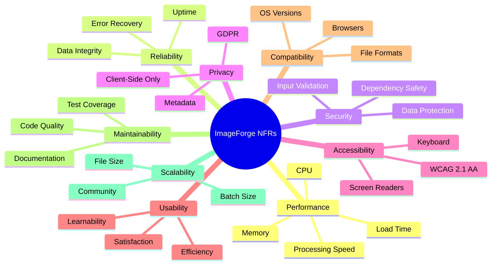

# Non-Functional Requirements

> **Document ID**: 06
> **Phase**: 1 — Product Planning
> **Status**: Approved
> **Last Updated**: 2026-07-27
> **Owner**: Architecture Team

---

## Table of Contents

1. [Purpose](#1-purpose)
2. [Scope](#2-scope)
3. [NFR Categories](#3-nfr-categories)
4. [Performance Requirements](#4-performance-requirements)
5. [Reliability Requirements](#5-reliability-requirements)
6. [Security Requirements](#6-security-requirements)
7. [Privacy Requirements](#7-privacy-requirements)
8. [Accessibility Requirements](#8-accessibility-requirements)
9. [Usability Requirements](#9-usability-requirements)
10. [Compatibility Requirements](#10-compatibility-requirements)
11. [Maintainability Requirements](#11-maintainability-requirements)
12. [Scalability Requirements](#12-scalability-requirements)
13. [Portability Requirements](#13-portability-requirements)
14. [Localization Requirements](#14-localization-requirements)
15. [Open Source Requirements](#15-open-source-requirements)
16. [Measurement & Monitoring](#16-measurement--monitoring)
17. [Related Documents](#17-related-documents)

---

## 1. Purpose

This document defines the Non-Functional Requirements (NFRs) for ImageForge — the quality attributes the system must possess beyond its functional behavior. NFRs define how the system performs, not what it does. They are equally important as functional requirements and must be treated as first-class requirements.

---

## 2. Scope

These NFRs apply to all platforms (Web, Android, iOS) unless specifically scoped. They cover the system in production, not development environments.

---

## 3. NFR Categories



---

## 4. Performance Requirements

### NFR-P-001: Web Initial Load Time

| Attribute                      | Target                    |
| ------------------------------ | ------------------------- |
| First Contentful Paint (FCP)   | ≤ 1.5 seconds (broadband) |
| Largest Contentful Paint (LCP) | ≤ 2.5 seconds (broadband) |
| Time to Interactive (TTI)      | ≤ 4.0 seconds (broadband) |
| First Input Delay (FID)        | ≤ 100ms                   |
| Cumulative Layout Shift (CLS)  | ≤ 0.1                     |

**Rationale**: Google Core Web Vitals are the industry standard for web performance. Meeting these thresholds ensures a good SEO score and user experience.

**Measurement**: Lighthouse CI in GitHub Actions on every PR.

### NFR-P-002: WASM Module Initialization

| Condition                         | Target        |
| --------------------------------- | ------------- |
| First visit (broadband, no cache) | ≤ 3.0 seconds |
| Return visit (cached)             | ≤ 0.5 seconds |
| Offline (Service Worker cache)    | ≤ 0.5 seconds |

**Rationale**: The WASM binary (~3–5MB) is the largest initialization cost. Caching is essential.

### NFR-P-003: Single Image Processing Time

| Operation                 | Input     | Target   |
| ------------------------- | --------- | -------- |
| Compress (JPEG 85%)       | 5MP, 3MB  | ≤ 500ms  |
| Resize (50%)              | 12MP, 6MB | ≤ 800ms  |
| Crop                      | Any       | ≤ 200ms  |
| Format Convert (PNG→WebP) | 5MP       | ≤ 1000ms |
| Filter Apply              | 5MP       | ≤ 300ms  |
| Enhancement (Brightness)  | 5MP       | ≤ 150ms  |

**Platform**: These targets apply to Web (WASM). Mobile may be 2–3x faster using native codecs.

**Measurement**: Automated benchmark suite run per release.

### NFR-P-004: Batch Processing Throughput

| Metric                            | Target                   |
| --------------------------------- | ------------------------ |
| Batch compression (10 × 5MP JPEG) | ≤ 8 seconds (Web)        |
| Batch resize (50 × 1MP)           | ≤ 15 seconds (Web)       |
| Worker pool size (Web)            | 4 workers (configurable) |

### NFR-P-005: UI Responsiveness

- The main UI thread must not be blocked for more than 16ms (60fps) during any operation.
- All image processing must occur on Web Workers (Web) or background threads (mobile).
- Loading spinners/progress indicators must appear within 100ms of operation start.

### NFR-P-006: Memory Limits

| Platform      | Max Memory Usage | Threshold Warning |
| ------------- | ---------------- | ----------------- |
| Web (Browser) | ≤ 500MB          | Alert at 400MB    |
| Android       | ≤ 300MB (heap)   | Alert at 250MB    |
| iOS           | ≤ 200MB (heap)   | Alert at 160MB    |

**Rationale**: Browsers and mobile OSes impose memory limits. Exceeding them causes crashes.

### NFR-P-007: Bundle Size

| Asset                   | Target  |
| ----------------------- | ------- |
| Web JS bundle (gzipped) | ≤ 500KB |
| WASM bundle (gzipped)   | ≤ 4MB   |
| Total initial payload   | ≤ 5MB   |
| Android APK             | ≤ 50MB  |
| iOS IPA                 | ≤ 60MB  |

### NFR-P-008: Mobile App Startup

| Metric                    | Target      |
| ------------------------- | ----------- |
| Cold start to interactive | ≤ 3 seconds |
| Warm start                | ≤ 1 second  |

---

## 5. Reliability Requirements

### NFR-R-001: Web Demo Uptime

Target: **99.9% uptime** for the Vercel-hosted web application.
This translates to ≤ 8.7 hours downtime per year.

**How**: Vercel SLA + automated health checks.

### NFR-R-002: Graceful Degradation

- If WASM initialization fails, the system shall display a clear error message with browser requirements, rather than a blank screen.
- If a processing operation fails, the system shall return the error to the user without losing their input image or queue state.
- If storage (IndexedDB/SQLite) is unavailable, the system shall fall back to in-memory state for the current session.

### NFR-R-003: Data Integrity

- Processing must never corrupt the original input image. Operations are always applied to a copy.
- Queue state must be recoverable after unexpected app termination.
- Processed outputs must be bit-identical to expected outputs for deterministic operations (lossless compression, rotation, resize).

### NFR-R-004: Error Recovery

- The system must handle OS memory warnings (mobile) by releasing cached thumbnails and clearing intermediate processing buffers.
- The system must handle browser tab visibility changes (Web) by pausing background workers when hidden.

---

## 6. Security Requirements

### NFR-S-001: Input Validation

- All uploaded files must be validated for MIME type (by reading magic bytes, not just file extension) before processing.
- Malformed EXIF data must not crash the application (safe parser required).
- SVG files must be sanitized before display to prevent XSS.

### NFR-S-002: Content Security Policy

The web application must enforce a strict Content Security Policy:

```
Content-Security-Policy: default-src 'self';
  script-src 'self' 'wasm-unsafe-eval';
  worker-src 'self' blob:;
  img-src 'self' blob: data:;
  connect-src 'self';
```

### NFR-S-003: Dependency Security

- All npm dependencies must be audited with `npm audit` as part of CI.
- High or critical severity vulnerabilities must be remediated within 48 hours.
- Dependencies must be pinned to exact versions in `package.json`.
- Dependabot must be enabled for automated security updates.

### NFR-S-004: No Remote Code Execution

- Plugin scripts must execute in isolated sandboxes (iframe or Worker sandbox).
- The plugin API must not expose Node.js or native file system APIs to plugin code.

### NFR-S-005: Secure Headers

All responses from the Vercel deployment must include:

```
Strict-Transport-Security: max-age=31536000; includeSubDomains
X-Content-Type-Options: nosniff
X-Frame-Options: SAMEORIGIN
Referrer-Policy: strict-origin-when-cross-origin
Cross-Origin-Opener-Policy: same-origin
Cross-Origin-Embedder-Policy: require-corp
```

---

## 7. Privacy Requirements

### NFR-PR-001: No Server-Side Image Transmission

Images must never be transmitted to any server unless the user explicitly initiates a cloud export. This is a hard, non-negotiable requirement.

**Verification**: Network request monitoring during automated tests; no outbound image requests to any domain.

### NFR-PR-002: No Personal Data Collection

ImageForge must not collect, store, or transmit personally identifiable information (PII) without explicit consent. EXIF data extracted from images is processed locally and never transmitted.

### NFR-PR-003: Analytics Must Be Opt-In

If analytics are implemented, they must:

- Be disabled by default
- Require explicit user opt-in
- Be anonymous (no user identification, no image content)
- Be transparent about what is collected
- Be fully removable (data deletion on opt-out)

### NFR-PR-004: GDPR Compliance Readiness

Even though ImageForge processes no user data by default, the architecture must be designed to support GDPR compliance in future phases:

- No cookies without consent (session-only cookies acceptable)
- Privacy policy accessible from the app
- Data processing transparent in the privacy policy

### NFR-PR-005: Metadata Privacy

- The system shall provide clear warnings when images contain GPS metadata
- The "Privacy Mode" option must strip all metadata before export
- Users must be informed about what metadata their images contain

---

## 8. Accessibility Requirements

### NFR-A-001: WCAG 2.1 AA Compliance

ImageForge must achieve WCAG 2.1 Level AA compliance across all platforms. Specific requirements:

| Criterion                  | Requirement                                      |
| -------------------------- | ------------------------------------------------ |
| 1.4.3 Contrast (Minimum)   | Text: 4.5:1 ratio; Large text: 3:1 ratio         |
| 1.4.11 Non-text Contrast   | UI components: 3:1 ratio against adjacent colors |
| 2.1.1 Keyboard             | All functions operable by keyboard               |
| 2.4.3 Focus Order          | Focus traversal is logical and sequential        |
| 2.4.7 Focus Visible        | Keyboard focus indicator always visible          |
| 3.3.1 Error Identification | Errors identified in text (not color alone)      |
| 4.1.2 Name, Role, Value    | All UI components have accessible names          |

### NFR-A-002: Screen Reader Support

- iOS: VoiceOver tested with all primary workflows
- Android: TalkBack tested with all primary workflows
- Web: NVDA + Chrome and JAWS + Chrome tested

### NFR-A-003: Dynamic Text Sizing

- Web: Font sizes must use `rem` units (respect user browser font size preferences)
- Mobile: Must respect OS Dynamic Type settings (iOS) and font size (Android)
- All layouts must accommodate text at 200% size without horizontal scrolling

### NFR-A-004: Motion Sensitivity

- All animations must respect `prefers-reduced-motion` media query (Web)
- Animations must be disableable in app settings (mobile)

---

## 9. Usability Requirements

### NFR-U-001: Learnability

- A first-time user with no instructions must complete a basic image compression within 60 seconds.
- Measured via: User testing sessions, task completion rate.

### NFR-U-002: Error Messages

- All error messages must be written in plain language (no error codes in user-facing messages).
- All errors must suggest a recovery action.
- Technical details must be available in expandable "Details" section for debugging.

### NFR-U-003: Discoverability

- All features must be accessible within 3 taps/clicks from the home screen.
- Feature categories must be visually distinct and logically grouped.

### NFR-U-004: Consistency

- The same operation must behave identically across Web, Android, and iOS.
- Visual design must be consistent across platforms (same tokens, same component library).

---

## 10. Compatibility Requirements

### NFR-C-001: Browser Support Matrix

| Browser          | Version | Support Level       |
| ---------------- | ------- | ------------------- |
| Chrome           | 90+     | Full (primary)      |
| Firefox          | 90+     | Full                |
| Safari           | 15.4+   | Full (limited AVIF) |
| Edge             | 90+     | Full                |
| Samsung Internet | 15+     | Full                |
| Opera            | 76+     | Full                |
| Chrome Android   | 90+     | Full                |
| Safari iOS       | 15.4+   | Full                |

Browser versions below minimum: Display "unsupported browser" message with upgrade link.

### NFR-C-002: Android Version Support

| Android Version  | API Level | Support               |
| ---------------- | --------- | --------------------- |
| Android 8.0 Oreo | 26        | Minimum (best effort) |
| Android 9 Pie    | 28        | Full                  |
| Android 10       | 29        | Full                  |
| Android 11       | 30        | Full                  |
| Android 12       | 31        | Full                  |
| Android 13       | 33        | Full                  |
| Android 14       | 34        | Full                  |

### NFR-C-003: iOS Version Support

| iOS Version | Support            |
| ----------- | ------------------ |
| iOS 15      | Minimum            |
| iOS 16      | Full (HEIC export) |
| iOS 17      | Full               |
| iOS 18      | Full               |

### NFR-C-004: File Format Compatibility

See [File Format Support](./76-file-format-support.md) for the complete matrix.

---

## 11. Maintainability Requirements

### NFR-M-001: Test Coverage

| Coverage Type                         | Target              |
| ------------------------------------- | ------------------- |
| Unit test line coverage               | ≥ 80%               |
| Unit test branch coverage             | ≥ 70%               |
| Integration test coverage (key flows) | ≥ 60%               |
| E2E test coverage (critical paths)    | 100% of P0 features |

### NFR-M-002: TypeScript Strictness

All TypeScript code must compile without errors under `strict: true` settings including:

- `noImplicitAny: true`
- `strictNullChecks: true`
- `strictFunctionTypes: true`
- `noUnusedLocals: true`
- `noUnusedParameters: true`

### NFR-M-003: Code Review Requirement

All changes to the `main` branch require at least 1 approval from a designated maintainer. All CI checks must pass.

### NFR-M-004: Documentation Completeness

Every public function, class, and type exported from a package must have a JSDoc comment explaining its purpose, parameters, and return value.

### NFR-M-005: Cyclomatic Complexity

No function may have a cyclomatic complexity score greater than 10. Functions exceeding this limit must be refactored.

### NFR-M-006: Dependency Governance

- No new dependencies may be added without documenting the justification in the PR description.
- Dependencies must be evaluated for: bundle size impact, security history, maintenance status, license.
- See [Dependency Analysis](./78-dependency-analysis.md) for the evaluation process.

---

## 12. Scalability Requirements

### NFR-SC-001: Batch Size

The system must support batch queues of up to 500 images without crashing or running out of memory, by using streaming processing (process and discard intermediates).

### NFR-SC-002: Image Size

The system must process images up to 100MB or 100 megapixels without crashing, using tile-based processing for extremely large images.

### NFR-SC-003: Codebase Scalability

The monorepo must support adding new packages and features without degrading build times (Turborepo cache ensures incremental builds).

### NFR-SC-004: Plugin Ecosystem

The plugin system must support 100+ community plugins without affecting core app performance (lazy loading, isolated execution).

---

## 13. Portability Requirements

### NFR-PO-001: Framework Independence

Business logic in `packages/image-core` must not depend on React, React Native, or any UI framework. Processing functions must be pure TypeScript.

### NFR-PO-002: Platform Independence of Business Logic

Processing logic must be executable in:

- Browser (via WASM)
- Node.js (for CLI tool, Phase 3)
- React Native (via native modules)

### NFR-PO-003: Export Portability

Processed images must be standard-compliant files that can be opened by any image viewer or editor.

---

## 14. Localization Requirements

### NFR-L-001: i18n Architecture

The application must use an internationalization framework (react-i18next) from day one, even if only English is shipped in MVP.

All user-facing strings must be externalized to translation files. No hardcoded English strings in components.

### NFR-L-002: Locale Support

MVP ships with English only. Architecture supports future addition of:

- Spanish, French, German (Phase 2)
- Japanese, Chinese (Simplified), Arabic (Phase 3)

### NFR-L-003: RTL Support

Layout must support Right-to-Left (RTL) rendering for Arabic and Hebrew locales (Phase 3).

---

## 15. Open Source Requirements

### NFR-OS-001: License Compliance

All code, dependencies, and assets must be compatible with the MIT License. License audit is required before every major release.

### NFR-OS-002: Contribution Friction

Time to first successful contribution for a new developer must be ≤ 2 hours with only the documentation.

### NFR-OS-003: Build Reproducibility

Given the same inputs (code + dependencies), the build must produce identical outputs on any CI environment (no timestamps, random IDs, or environment-specific values in build artifacts).

---

## 16. Measurement & Monitoring

### Performance Monitoring

| Tool                        | Purpose                                |
| --------------------------- | -------------------------------------- |
| Lighthouse CI               | Web performance (FCP, LCP, TTI) per PR |
| Benchmark suite             | Processing speed per release           |
| Sentry (optional)           | Error tracking (opt-in only)           |
| Vercel Analytics (optional) | Web vitals monitoring (anonymous)      |

### Quality Monitoring

| Tool                | Purpose                        |
| ------------------- | ------------------------------ |
| Vitest / Jest       | Unit/integration test coverage |
| Playwright          | E2E test execution             |
| axe-core            | Automated accessibility scan   |
| ESLint + TypeScript | Static analysis in CI          |

### Performance Budgets in CI

Build fails if:

- Lighthouse score drops below 85 (performance), 90 (accessibility)
- JS bundle exceeds 500KB gzipped
- Test coverage drops below 80%
- TypeScript compilation fails

---

## 17. Related Documents

| Document                                                         | Relationship                        |
| ---------------------------------------------------------------- | ----------------------------------- |
| [05-functional-requirements.md](./05-functional-requirements.md) | Functional requirements (what)      |
| [36-performance-strategy.md](./36-performance-strategy.md)       | Performance implementation strategy |
| [37-security-architecture.md](./37-security-architecture.md)     | Security implementation             |
| [56-accessibility.md](./56-accessibility.md)                     | Accessibility implementation        |
| [performance/benchmark-plan.md](./performance/benchmark-plan.md) | Benchmark methodology               |
| [security/privacy.md](./security/privacy.md)                     | Privacy implementation              |

---

_Document Owner: Architecture Team | Review Cycle: Quarterly | Approved: 2026-07-27_
