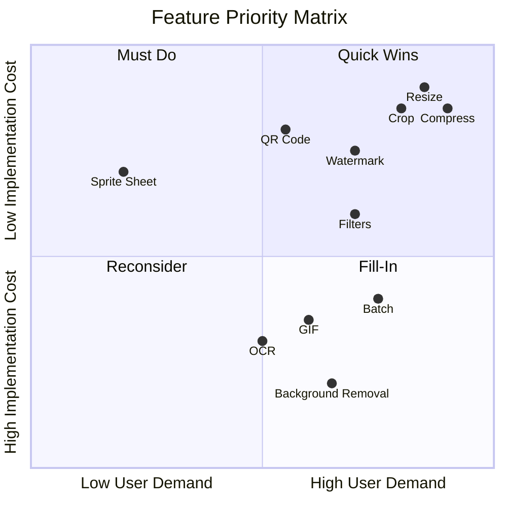

# Feature Prioritization

> **Document ID**: 10
> **Phase**: 1 — Product Planning
> **Status**: Approved
> **Last Updated**: 2026-07-27
> **Owner**: Product Team

---

## Purpose

This document defines the MoSCoW prioritization (Must Have, Should Have, Could Have, Won't Have) for all ImageForge features, providing a clear, justified ranking for development sequencing.

## Scope

All features from `ImageForge.md` and the PRD, organized by priority tier.

---

## MoSCoW Framework

| Priority | Label       | Definition                                        |
| -------- | ----------- | ------------------------------------------------- |
| **M**    | Must Have   | Core value proposition. Product fails without it. |
| **S**    | Should Have | Important but not critical for initial release.   |
| **C**    | Could Have  | Nice to have; included if capacity allows.        |
| **W**    | Won't Have  | Explicitly excluded from this release cycle.      |

---

## Must Have (MVP — Phase 1)

These features define what ImageForge is. Without any of these, the MVP is not viable.

| Feature                                    | Justification                                                                                | Target Persona    |
| ------------------------------------------ | -------------------------------------------------------------------------------------------- | ----------------- |
| **Image Import (File/DnD/Gallery/Camera)** | Entry point to all workflows. Without import, nothing works.                                 | All               |
| **Compression (Lossy + Lossless)**         | The #1 use case for image tools. Key competitive feature.                                    | Alex, Sam, Jordan |
| **Resize**                                 | Second most common use case globally. Required for social media use.                         | All               |
| **Crop**                                   | Third most common operation. Circle crop for profile pictures is a differentiator.           | All               |
| **Rotate & Flip**                          | Basic orientation correction. Without this, misoriented camera photos are unusable.          | All               |
| **Format Conversion (5 core formats)**     | HEIC→JPEG is Alex's primary mobile use case. PNG→WebP is Sam's.                              | Alex, Sam         |
| **Batch Processing**                       | Without batch, ImageForge is just another single-image tool. This is the key differentiator. | Sam, Jordan       |
| **Download / Export / Share**              | Without output, the tool is useless.                                                         | All               |
| **Undo/Redo History**                      | Non-destructive editing is a baseline expectation for any editing tool.                      | All               |
| **Settings (defaults/theme)**              | Professional users expect configurable defaults.                                             | Sam, Morgan       |
| **PWA + Service Worker (Web)**             | Offline support is a core principle. Without it, the Live Demo is fragile.                   | All (Web)         |
| **WASM Processing Engine (Web)**           | Without WASM, web processing falls back to Canvas which lacks professional features.         | All (Web)         |
| **Dark/Light Theme**                       | Expected by all modern apps.                                                                 | All               |
| **Duplicate Detection**                    | Without this, batch imports contain accidental duplicates causing confusion.                 | Sam, Jordan       |

---

## Should Have (Phase 2)

These add significant value and should be implemented shortly after MVP to prevent user churn.

| Feature                                            | Justification                                                                                              | Target Persona |
| -------------------------------------------------- | ---------------------------------------------------------------------------------------------------------- | -------------- |
| **Image Enhancement** (brightness, contrast, etc.) | Power users expect color correction. Without this, ImageForge can't replace Lightroom for basic edits.     | Jordan, Casey  |
| **Filters & LUTs**                                 | Casey's primary need. Social media creators expect filters.                                                | Casey          |
| **Watermark**                                      | Jordan's delivery workflow requires watermarks. High frequency use case.                                   | Jordan, Sam    |
| **Metadata View & Edit**                           | GPS removal is a privacy feature that users actively seek. Legal relevance for professional photographers. | Jordan, Sam    |
| **Drawing / Annotation**                           | Text and shapes are expected in "image editors."                                                           | Sam, Casey     |
| **Blur Effects**                                   | Face blur is a privacy feature. Background blur is popular for portraits.                                  | Jordan, Casey  |
| **QR Code Generate & Scan**                        | QR embedding is a watermark/link use case. Broad appeal.                                                   | Casey          |
| **AVIF/TIFF/ICO output**                           | Completes the format conversion feature. AVIF is the future of web images.                                 | Sam, Morgan    |
| **Project Workspace**                              | Enables session persistence for power users working on ongoing projects.                                   | Sam, Jordan    |
| **Plugin API (design + basic impl)**               | Establishes the extensibility architecture. Morgan evaluates this.                                         | Morgan         |
| **Collage Builder**                                | Casey's use case. Grid layouts are widely used for social media.                                           | Casey          |

---

## Could Have (Phase 3)

Valuable features that enhance the product but aren't critical for retention.

| Feature                        | Justification                                              | Notes                |
| ------------------------------ | ---------------------------------------------------------- | -------------------- |
| **GIF Creation**               | Casey needs this. Differentiator from Squoosh.             | FFmpeg WASM required |
| **PDF Tools**                  | Sam's document delivery use case.                          | pdf-lib integration  |
| **Background Removal**         | High demand, popular feature. Requires ML model.           | RMBG/U2Net WASM      |
| **OCR**                        | Niche but high-value. Tesseract.js.                        | Large WASM bundle    |
| **Face Detection + Face Blur** | Privacy feature. High public interest post-GDPR.           | ML model required    |
| **Duplicate Finder (full)**    | Advanced pHash-based UI. MVP has basic SHA-256 alert only. | Phase 3 UI           |
| **Icon Generator**             | Developer tool. Strong appeal to Morgan persona.           |                      |
| **Image Comparison**           | Before/after for editors.                                  | Simple split-view    |
| **Analytics (opt-in)**         | Needed to make data-driven product decisions post-MVP.     | Must be privacy-safe |
| **CLI Tool**                   | Morgan persona. `npx imageforge compress ...`              | Node.js wrapper      |
| **Sprite Sheet Builder**       | Developer niche feature.                                   |                      |
| **Contact Sheet**              | Photographer review use case.                              |                      |

---

## Won't Have (This Release Cycle)

Explicitly excluded. These are documented to prevent repeated discussions.

| Feature                                  | Reason                                                             |
| ---------------------------------------- | ------------------------------------------------------------------ |
| **AI Super Resolution**                  | Requires WASM ML runtime (ONNX.js) and large model files. Phase 6. |
| **AI Object Removal**                    | Complex ML inference. Phase 6.                                     |
| **AI Denoise / Restoration**             | Phase 6.                                                           |
| **Real-time Collaboration**              | Requires backend; violates privacy-first.                          |
| **Cloud Storage**                        | Violates privacy-first for MVP. Opt-in Phase 4+.                   |
| **User Accounts**                        | Not needed for core value. Phase 4+.                               |
| **Desktop App (Electron/Tauri)**         | Phase 5.                                                           |
| **Enterprise Features (SSO, audit log)** | Phase 7.                                                           |
| **Video Timeline Editing**               | Out of scope permanently.                                          |
| **CMYK/Print Profiles**                  | Out of scope.                                                      |
| **Plugin Marketplace**                   | Phase 3.                                                           |
| **Automation/Pipeline Scheduling**       | Phase 3+.                                                          |

---

## Prioritization Decision Rationale

### Why Batch Processing is Must Have

Most tools treat batch as a premium feature. ImageForge makes it a first-class MVP capability. Rationale:

- Sam and Jordan (two of five personas) depend on batch for their primary workflow
- Batch is the key differentiator from Squoosh and similar single-image tools
- Implementing batch requires the Worker Pool and Queue architecture — these are foundational and harder to add later
- Without batch, ImageForge is compelling for Alex but not for Sam/Jordan, the most engaged users

### Why Enhancement/Filters are Should Have (not Must Have)

Alex (the casual user) doesn't need filters. Sam's priority is batch + format conversion. Jordan needs batch + watermark. Only Casey actively needs filters in Phase 1. Filters are a Should Have because:

- They don't affect the core processing pipeline architecture
- They can be added without rearchitecting anything
- The GPU shader integration (Skia) is designed for them, but the UI can ship without it

### Why Background Removal is Could Have (not Should Have)

Background removal requires a WASM ML model (~15MB additional download) and significant integration work. The quality of browser-based background removal models (vs. Adobe Sensei, etc.) is noticeably lower. Shipping a mediocre background removal in Phase 2 would hurt product perception. A polished Phase 3 implementation is preferable.

---

## Priority Matrix

---

_Document Owner: Product Team | Review Cycle: Per-phase | Approved: 2026-07-27_
