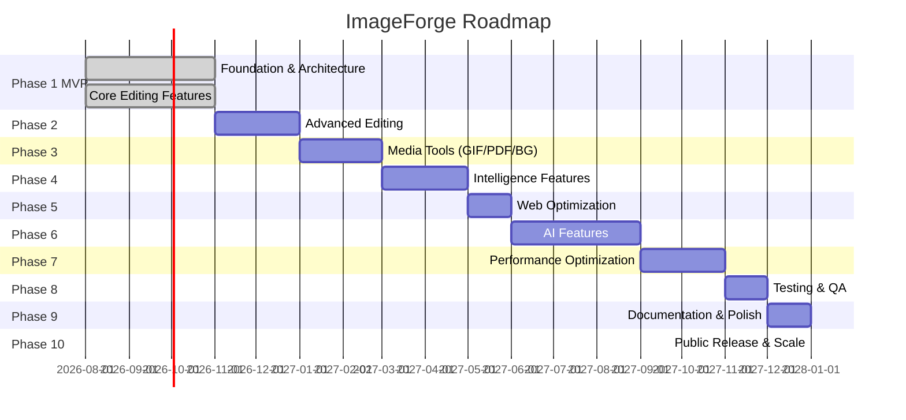
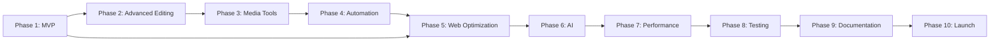

# Product Roadmap

> **Document ID**: 12
> **Phase**: 1 — Product Planning
> **Status**: Approved
> **Last Updated**: 2026-07-27
> **Owner**: Product Team

---

## Purpose

This document defines the 10-phase product roadmap for ImageForge, mapping features to phases, defining phase milestones, and establishing dependencies between phases.

## Scope

The complete post-launch roadmap. Each phase builds on the previous and delivers independently valuable increments.

---

## Roadmap Philosophy

1. **Phases are increments, not timeboxes**: Phases are defined by feature completeness, not calendar dates.
2. **MVP first**: No Phase 2 work begins until MVP exits its quality gates.
3. **Parallelism within phases**: Multiple features within a phase can be developed in parallel.
4. **Community-driven ordering**: Phase order may shift based on community feedback and contributor interest.

---

## Phase Overview

---

## Phase 1 — Foundation & Architecture (MVP)

**Theme**: Get the foundational platform right. Core editing features must be excellent.

### Deliverables

| Category            | Features                                                                    |
| ------------------- | --------------------------------------------------------------------------- |
| **Infrastructure**  | Turborepo monorepo, all packages, CI/CD, Vercel deployment                  |
| **Core Processing** | Compress, Resize, Crop, Rotate, Flip, Format Conversion (5 formats)         |
| **Batch Engine**    | Queue, pipeline, pause/resume/retry, persistence                            |
| **Import/Export**   | File picker, D&D, clipboard (Web), Gallery, Camera (Mobile), Download/Share |
| **UX**              | Undo/Redo, Dark/Light theme, Settings, Duplicate detection                  |
| **Platform**        | Web PWA, Android, iOS                                                       |
| **Quality**         | >80% test coverage, Lighthouse ≥85, WCAG 2.1 AA                             |
| **Documentation**   | Complete docs set (142 files)                                               |

### Exit Criteria

- All MVP exit criteria from [11-mvp-definition.md](./11-mvp-definition.md) met
- Published on Vercel, Play Store, App Store
- GitHub launch announcement

---

## Phase 2 — Advanced Editing

**Theme**: Make ImageForge the go-to professional editing tool with rich editing capabilities.

### Deliverables

| Feature                  | Description                                                                                                    |
| ------------------------ | -------------------------------------------------------------------------------------------------------------- |
| **Image Enhancement**    | Brightness, contrast, exposure, saturation, hue, gamma, white balance, curves, levels, histogram, auto-enhance |
| **Filters & LUTs**       | 6 built-in presets, custom .cube import, intensity slider, GPU preview                                         |
| **Watermark**            | Text, image/logo, QR, 9-anchor positioning, batch watermark                                                    |
| **Metadata**             | Full EXIF/IPTC/XMP view, field editing, GPS removal, strip all                                                 |
| **Drawing Tools**        | Brush, shapes, text, emoji, stickers, eraser, undo/redo layers                                                 |
| **Blur Effects**         | Gaussian, motion, pixelate, mosaic, selective mask blur                                                        |
| **QR Code**              | Generate, decode, embed into image                                                                             |
| **Collage Builder**      | Grid + free-form layouts, templates                                                                            |
| **AVIF/TIFF/ICO output** | Complete format conversion matrix                                                                              |
| **Project Workspace**    | Named projects, auto-save, session restore                                                                     |
| **Plugin API**           | API design, sandboxed runtime, plugin registry                                                                 |

### Dependencies

- Phase 1 complete and stable
- React Native Skia fully integrated (for GPU shader filters)
- Plugin API requires stable public interfaces from Phase 1

---

## Phase 3 — Media Tools

**Theme**: Expand into media creation and intelligence features that no competitor offers.

### Deliverables

| Feature                   | Description                                                                |
| ------------------------- | -------------------------------------------------------------------------- |
| **GIF Creation**          | Image sequence → GIF, Video → GIF, frame control, loop settings            |
| **PDF Tools**             | Images → PDF, merge, split, extract images                                 |
| **Background Removal**    | WASM ML model (RMBG/U2Net), transparent PNG, replace with color/image/blur |
| **OCR**                   | Tesseract.js (Web), ML Kit (mobile), multi-language, highlight regions     |
| **Face Detection & Blur** | Detect, count, blur, face-aware crop                                       |
| **Duplicate Finder**      | pHash-based detection, review and delete UI                                |
| **Image Comparison**      | Before/after slider for two images                                         |
| **Icon Generator**        | iOS, Android, favicon icon sets with ZIP export                            |
| **Analytics (opt-in)**    | Anonymous usage analytics, product telemetry                               |
| **CLI Tool**              | `npx @imageforge/cli compress ...`                                         |
| **Plugin Marketplace**    | Community plugin registry, install from URL                                |

### Dependencies

- FFmpeg WASM integration for video-to-GIF
- WASM ML runtime (ONNX.js) for background removal and face detection
- Phase 2 plugin API for marketplace

---

## Phase 4 — Intelligence & Automation

**Theme**: Reduce manual effort with smart automation and batch pipeline templates.

### Deliverables

| Feature                   | Description                                               |
| ------------------------- | --------------------------------------------------------- |
| **Pipeline Automation**   | Saved pipeline templates, trigger on folder watch         |
| **Smart Crop**            | Saliency-based automatic crop region detection            |
| **Auto Enhancement**      | Improved AI-powered auto-enhance for batch                |
| **Sprite Sheet Builder**  | Combine images into sprite sheet with JSON coordinate map |
| **Contact Sheet**         | Generate thumbnail grid from collection                   |
| **Cloud Export (opt-in)** | Google Drive, Dropbox export integration                  |
| **Optional Account**      | GitHub OAuth for settings sync (no image storage)         |

---

## Phase 5 — Web Optimization

**Theme**: Make the web demo world-class. Target Google Lighthouse 100.

### Deliverables

| Focus                       | Actions                                                             |
| --------------------------- | ------------------------------------------------------------------- |
| **Performance**             | WASM SIMD, parallel worker pool tuning, streaming for large batches |
| **Bundle Optimization**     | Advanced code splitting, WASM lazy loading refinement               |
| **PWA Enhancement**         | Background sync, push notifications for batch completion            |
| **SEO**                     | Server-side rendering for landing page, meta tags, sitemaps         |
| **Lighthouse 95+**          | Achieve 95+ on all Lighthouse categories                            |
| **International Expansion** | Spanish, French, German translations                                |

---

## Phase 6 — AI Features

**Theme**: Integrate on-device AI for capabilities no traditional library can match.

### Deliverables

| AI Feature           | Model                          | Description                            |
| -------------------- | ------------------------------ | -------------------------------------- |
| **Super Resolution** | Real-ESRGAN WASM               | 2× / 4× upscaling without quality loss |
| **AI Denoise**       | DnCNN / NAFNet                 | Noise removal for ISO-damaged photos   |
| **AI Restoration**   | CodeFormer                     | Face restoration and old photo repair  |
| **AI Colorization**  | DeOldify WASM                  | Black & white to color                 |
| **Object Removal**   | LaMa inpainting                | Remove objects with background fill    |
| **AI Expansion**     | Stable Diffusion (constrained) | Canvas expansion / outpainting         |

### Constraints

- All models run in-browser via ONNX.js / TensorFlow.js
- No images sent to any server
- Models loaded on demand (not in initial bundle)
- Model sizes: 50–200MB (cached after first use)

---

## Phase 7 — Performance Optimization

**Theme**: Systematic performance improvements based on production metrics.

### Deliverables

- Full memory profiling and optimization pass
- React Native performance audit (Flashlist, memo, callbacks)
- Web Worker pool dynamic sizing based on hardware concurrency
- WASM SharedArrayBuffer zero-copy processing
- Tile-based processing for very large images (>50MP)
- Native module performance for mobile processing

---

## Phase 8 — Testing

**Theme**: Achieve world-class test coverage and automated quality assurance.

### Deliverables

- Unit test coverage → 90%+
- Visual regression testing (Chromatic / Percy)
- Automated accessibility regression testing
- Performance regression testing in CI
- Fuzzing for image parser edge cases
- Cross-browser E2E testing matrix

---

## Phase 9 — Documentation & Polish

**Theme**: Make the project irresistible to contributors and users.

### Deliverables

- Video documentation (architecture walkthrough, contributing guide)
- Interactive documentation site (Docusaurus / Nextra)
- Storybook for component library
- API reference auto-generated from TypeDoc
- Benchmark results published on website
- 10+ translated UI languages

---

## Phase 10 — Public Release & Scale

**Theme**: Official v1.0 public launch and long-term sustainability.

### Deliverables

- v1.0.0 tagged and released
- Product Hunt launch
- Hacker News "Show HN" post
- Developer blog post series (architecture, WASM, RN Web)
- GitHub Stars target: 5,000
- NPM packages ecosystem mature
- Enterprise roadmap evaluation (SSO, team workspaces)

---

## Roadmap Dependency Map

---

_Document Owner: Product Team | Review Cycle: Per-phase | Approved: 2026-07-27_
