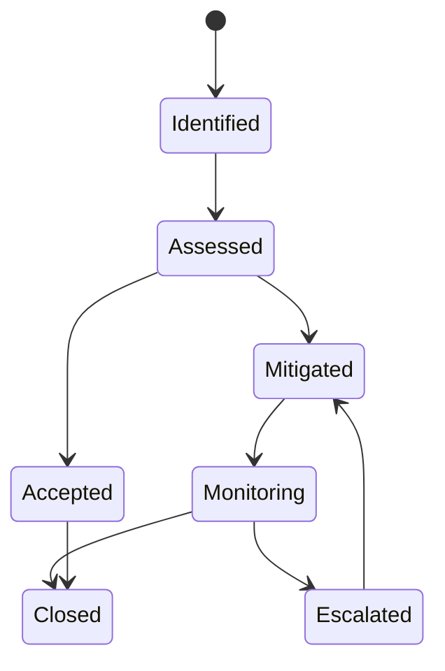

# Risk Register

> **Document ID**: 14
> **Phase**: 1 — Product Planning
> **Status**: Active (living document)
> **Last Updated**: 2026-07-27
> **Owner**: Architecture Team

---

## Table of Contents

1. [Purpose](#1-purpose)
2. [Scope](#2-scope)
3. [Risk Management Approach](#3-risk-management-approach)
4. [Risk Assessment Matrix](#4-risk-assessment-matrix)
5. [Technical Risks](#5-technical-risks)
6. [Product Risks](#6-product-risks)
7. [Operational Risks](#7-operational-risks)
8. [Legal & Compliance Risks](#8-legal--compliance-risks)
9. [Community & Open Source Risks](#9-community--open-source-risks)
10. [Risk Summary Table](#10-risk-summary-table)
11. [Risk Response Procedures](#11-risk-response-procedures)
12. [Related Documents](#12-related-documents)

---

## 1. Purpose

This Risk Register identifies, categorizes, assesses, and defines mitigation strategies for all significant risks facing the ImageForge project. It is a **living document** — risks are added, updated, and closed as the project evolves.

Maintaining this register ensures the team is never surprised by foreseeable problems.

---

## 2. Scope

All risks that could materially affect the project's ability to:

- Ship the MVP on time and with defined quality
- Achieve post-launch adoption targets
- Maintain architectural integrity over time
- Operate as a trustworthy open-source project

---

## 3. Risk Management Approach

### Risk Lifecycle



### Probability Scale

| Score | Label     | Definition                |
| ----- | --------- | ------------------------- |
| 1     | Very Low  | < 10% chance of occurring |
| 2     | Low       | 10–30% chance             |
| 3     | Medium    | 30–60% chance             |
| 4     | High      | 60–80% chance             |
| 5     | Very High | > 80% chance              |

### Impact Scale

| Score | Label      | Definition                                                    |
| ----- | ---------- | ------------------------------------------------------------- |
| 1     | Negligible | Minor inconvenience, no schedule/quality impact               |
| 2     | Minor      | Small delay or workaround required                            |
| 3     | Moderate   | Significant rework, 2–4 week delay                            |
| 4     | Major      | Core feature affected, >1 month delay or architectural change |
| 5     | Critical   | Project viability threatened                                  |

### Risk Score = Probability × Impact

| Score | Level    | Action                             |
| ----- | -------- | ---------------------------------- |
| 1–4   | Low      | Accept or monitor                  |
| 5–9   | Medium   | Mitigation plan required           |
| 10–15 | High     | Immediate mitigation required      |
| 16–25 | Critical | Stop and address before continuing |

---

## 4. Risk Assessment Matrix

```
Impact →
↑           1-Neg    2-Minor   3-Mod    4-Major   5-Crit
Probability
5-Very High    5        10        15       20        25
4-High         4         8        12       16        20
3-Medium       3         6         9       12        15
2-Low          2         4         6        8        10
1-Very Low     1         2         3        4         5
```

---

## 5. Technical Risks

---

### RISK-T-001: WebAssembly Performance Insufficient

| Field           | Value        |
| --------------- | ------------ |
| **ID**          | RISK-T-001   |
| **Category**    | Technical    |
| **Probability** | 2 (Low)      |
| **Impact**      | 5 (Critical) |
| **Risk Score**  | 10 (High)    |
| **Status**      | Mitigated    |

**Description**: libvips compiled to WebAssembly may not achieve the processing speed targets (< 500ms for a 5MP JPEG compression) on lower-end hardware (budget laptops, older Android browsers).

**Evidence of Risk**: WASM runs at approximately 50–80% of native speed. libvips is highly optimized. WASM SIMD (Single Instruction, Multiple Data) is available in modern browsers and improves performance significantly but is not universally supported.

**Impact if Realized**: The web demo feels sluggish compared to competing tools, driving users away. The privacy-first client-side processing model may need to be reconsidered.

**Mitigation Strategies**:

1. **Early benchmark suite**: Run benchmarks against performance targets before committing to WASM approach
2. **WASM SIMD**: Compile libvips with SIMD support for 3–5× speedup on supported browsers
3. **Progressive loading**: Start WASM initialization on page load before user selects an image
4. **Fallback tier**: For extreme cases (very large images > 50MP), offer a browser-native Canvas fallback with reduced feature set
5. **Worker pool**: Use 2–4 parallel Web Workers to pipeline multi-image batches

**Monitoring**: Benchmark suite runs on every release. Regression alerts if any operation exceeds 2× the target.

---

### RISK-T-002: React Native Web Compatibility Gaps

| Field           | Value        |
| --------------- | ------------ |
| **ID**          | RISK-T-002   |
| **Category**    | Technical    |
| **Probability** | 3 (Medium)   |
| **Impact**      | 3 (Moderate) |
| **Risk Score**  | 9 (Medium)   |
| **Status**      | Monitoring   |

**Description**: React Native Web does not support all React Native APIs perfectly. Some components or behaviors available on mobile may be unavailable or behave differently on Web. This could force significant per-platform code divergence.

**Known Gaps (as of RNW 0.19)**:

- `Modal` component has different behaviors on Web
- `InputAccessoryView` is iOS-only
- Some `Animated` APIs differ
- `VirtualizedList` performance on Web lags behind native FlashList

**Mitigation**:

1. **Platform abstraction layer**: All platform-specific code goes behind `.web.ts`/`.native.ts` file pairs
2. **Early spike**: Build all core UI primitives as a proof-of-concept before committing to the full feature set
3. **RNW issue tracking**: Monitor RNW GitHub for known issues affecting ImageForge components

---

### RISK-T-003: HEIC/AVIF Browser Support Fragmentation

| Field           | Value      |
| --------------- | ---------- |
| **ID**          | RISK-T-003 |
| **Category**    | Technical  |
| **Probability** | 4 (High)   |
| **Impact**      | 2 (Minor)  |
| **Risk Score**  | 8 (Medium) |
| **Status**      | Accepted   |

**Description**: HEIC is not natively decodable in any desktop browser (as of 2026). AVIF output is not supported on Safari 15 or older browsers. This requires WASM fallback decoders for these formats.

**Mitigation**:

1. **HEIC WASM decoder**: `libheif` compiled to WASM for decoding on Web
2. **AVIF detection**: Feature-detect AVIF support; only offer as output on capable browsers
3. **Graceful degradation**: If a format is unsupported, suggest an alternative (e.g., "AVIF not supported in your browser — use WebP instead")
4. **Browser Compatibility doc**: Maintain up-to-date [browser support matrix](./48-browser-compatibility.md)

---

### RISK-T-004: Expo Managed Workflow Limitations

| Field           | Value      |
| --------------- | ---------- |
| **ID**          | RISK-T-004 |
| **Category**    | Technical  |
| **Probability** | 2 (Low)    |
| **Impact**      | 4 (Major)  |
| **Risk Score**  | 8 (Medium) |
| **Status**      | Monitoring |

**Description**: Expo Managed Workflow may not support a native module or capability required by ImageForge that cannot be addressed via a Config Plugin.

**Specific Risks**:

- Custom libvips native module may require bare workflow
- Background processing capabilities may need bare workflow
- Custom native image codec integration

**Mitigation**:

1. **Config Plugin first**: Attempt every native requirement via Config Plugin before considering ejection
2. **Ejection contingency**: Document a clear ejection procedure in advance; test that it doesn't break existing functionality
3. **Bare workflow readiness**: Design the app to be ejection-ready (no Expo-only APIs in business logic)

---

### RISK-T-005: WASM Binary Size Too Large

| Field           | Value        |
| --------------- | ------------ |
| **ID**          | RISK-T-005   |
| **Category**    | Technical    |
| **Probability** | 3 (Medium)   |
| **Impact**      | 3 (Moderate) |
| **Risk Score**  | 9 (Medium)   |
| **Status**      | Monitoring   |

**Description**: The combined WASM binaries (libvips + FFmpeg + mozjpeg + pngquant + Skia CanvasKit) may exceed acceptable bundle sizes, causing slow initial load on mobile browsers and poor Lighthouse scores.

**Estimated Sizes**:

- libvips WASM: ~3.5MB (gzipped)
- FFmpeg WASM: ~7MB (gzipped) — only loaded on demand
- mozjpeg WASM: ~300KB
- pngquant WASM: ~200KB
- Skia CanvasKit: ~3MB (gzipped)

**Mitigation**:

1. **Lazy loading**: Load WASM modules on demand, not on initial page load
2. **Code splitting**: FFmpeg WASM only loaded when GIF creation or video-to-GIF is accessed
3. **Service Worker caching**: After first load, WASM is served from cache
4. **Separate worker chunks**: Each WASM module loaded in its dedicated Web Worker
5. **Size budgets enforced in CI**: Build fails if total initial payload exceeds 5MB

---

### RISK-T-006: Memory Exhaustion on Large Batches

| Field           | Value      |
| --------------- | ---------- |
| **ID**          | RISK-T-006 |
| **Category**    | Technical  |
| **Probability** | 3 (Medium) |
| **Impact**      | 4 (Major)  |
| **Risk Score**  | 12 (High)  |
| **Status**      | Mitigated  |

**Description**: Processing a batch of 500 high-resolution images could exhaust browser memory limits (~4GB on 64-bit browsers, much less on mobile browsers), causing crashes.

**Mitigation**:

1. **Streaming processing**: Process one image at a time per worker; release memory after each completes
2. **Memory monitoring**: Use `performance.memory` (Chrome) to monitor heap usage; pause queue if approaching limit
3. **Thumbnail LRU cache**: Limit thumbnail cache to 100 items, evict least-recently-used
4. **Graceful memory warning**: Alert user when memory usage is high, suggest reducing batch size
5. **Tile-based processing for huge images**: Split >50MP images into tiles if necessary

---

### RISK-T-007: React Native New Architecture Instability

| Field           | Value        |
| --------------- | ------------ |
| **ID**          | RISK-T-007   |
| **Category**    | Technical    |
| **Probability** | 2 (Low)      |
| **Impact**      | 3 (Moderate) |
| **Risk Score**  | 6 (Medium)   |
| **Status**      | Monitoring   |

**Description**: The React Native New Architecture (JSI, Fabric, TurboModules) is relatively new. Some libraries may not be compatible, requiring workarounds.

**Mitigation**:

1. **Compatibility audit**: Verify all key libraries support New Architecture before adopting them
2. **Fallback bridge mode**: Expo SDK supports reverting to legacy bridge per-module if needed
3. **Pin library versions**: Avoid automatic minor updates of RN-adjacent libraries

---

## 6. Product Risks

---

### RISK-P-001: Low Adoption / GitHub Traction

| Field           | Value        |
| --------------- | ------------ |
| **ID**          | RISK-P-001   |
| **Category**    | Product      |
| **Probability** | 3 (Medium)   |
| **Impact**      | 3 (Moderate) |
| **Risk Score**  | 9 (Medium)   |
| **Status**      | Monitoring   |

**Description**: ImageForge may not gain sufficient GitHub traction (stars, contributors) to establish itself as the reference implementation. Without community validation, the project serves only as a personal portfolio piece.

**Mitigation**:

1. **Quality README**: First impression matters — animated GIF demos, architecture diagram, live demo link
2. **Launch strategy**: Coordinated announcement on Hacker News, Reddit (r/reactnative), Twitter/X, Dev.to, Expo Discord
3. **SEO optimization**: Web demo must rank for key terms ("compress image online", "react native web example")
4. **Content marketing**: Technical blog posts explaining architecture decisions

---

### RISK-P-002: Competing Tool Dominance

| Field           | Value      |
| --------------- | ---------- |
| **ID**          | RISK-P-002 |
| **Category**    | Product    |
| **Probability** | 3 (Medium) |
| **Impact**      | 2 (Minor)  |
| **Risk Score**  | 6 (Medium) |
| **Status**      | Accepted   |

**Description**: Squoosh (Google), iLoveIMG, and other established tools are well-entrenched. ImageForge may struggle to capture user attention.

**Mitigation**: ImageForge's differentiators (cross-platform, privacy-first, open-source, batch processing, mobile app) are distinct enough from Squoosh (single-image only, no batch, no mobile app) to serve a different audience. This risk is accepted.

---

## 7. Operational Risks

---

### RISK-O-001: Vercel Free Tier Bandwidth Exceeded

| Field           | Value        |
| --------------- | ------------ |
| **ID**          | RISK-O-001   |
| **Category**    | Operational  |
| **Probability** | 2 (Low)      |
| **Impact**      | 3 (Moderate) |
| **Risk Score**  | 6 (Medium)   |
| **Status**      | Monitoring   |

**Description**: The Vercel free tier provides 100GB bandwidth per month. With a ~5MB initial WASM payload, this supports ~20,000 unique visitors per month. Viral growth could exceed this.

**Mitigation**:

1. **Service Worker caching**: WASM served from SW cache after first visit dramatically reduces CDN bandwidth per returning user
2. **CDN for WASM**: Host WASM binaries on a separate CDN (jsDelivr, GitHub Releases) to offload from Vercel
3. **Upgrade path**: Vercel Pro ($20/month) provides unlimited bandwidth — budget this if traffic warrants

---

### RISK-O-002: App Store Review Rejection

| Field           | Value        |
| --------------- | ------------ |
| **ID**          | RISK-O-002   |
| **Category**    | Operational  |
| **Probability** | 2 (Low)      |
| **Impact**      | 3 (Moderate) |
| **Risk Score**  | 6 (Medium)   |
| **Status**      | Monitoring   |

**Description**: Apple or Google could reject the app submission, delaying launch.

**Common Rejection Reasons**:

- Requesting unnecessary permissions
- Incomplete privacy policy
- App crashes during review
- Missing app metadata

**Mitigation**:

1. Follow App Store / Play Store submission guidelines closely
2. Only request permissions actually used
3. Write a clear privacy policy before submission
4. Test on a variety of devices before submission
5. Maintain an enterprise developer account as backup

---

## 8. Legal & Compliance Risks

---

### RISK-L-001: GPL License Contamination

| Field           | Value      |
| --------------- | ---------- |
| **ID**          | RISK-L-001 |
| **Category**    | Legal      |
| **Probability** | 3 (Medium) |
| **Impact**      | 4 (Major)  |
| **Risk Score**  | 12 (High)  |
| **Status**      | Mitigated  |

**Description**: FFmpeg is LGPL/GPL licensed. Using it in a statically-linked binary may require ImageForge to be GPL-licensed, violating the MIT commitment.

**Mitigation**:

1. **Use FFmpeg via WASM (dynamically loaded)**: LGPL allows dynamic linking without GPL propagation
2. **License audit**: Run `license-checker` on all dependencies in CI
3. **Optional FFmpeg module**: If GPL contamination is confirmed, isolate FFmpeg functionality in a separately loaded module with explicit license disclosure to the user
4. **Legal review**: Consult with an open-source legal advisor before first release

---

### RISK-L-002: GDPR / Privacy Regulation

| Field           | Value        |
| --------------- | ------------ |
| **ID**          | RISK-L-002   |
| **Category**    | Legal        |
| **Probability** | 2 (Low)      |
| **Impact**      | 3 (Moderate) |
| **Risk Score**  | 6 (Medium)   |
| **Status**      | Accepted     |

**Description**: GDPR and other privacy regulations impose requirements on apps handling personal data. ImageForge processes images which may contain PII (faces, location data).

**Mitigation**: Since ImageForge processes all images locally and transmits no data to servers, GDPR Article 2(2) (household exception) and the nature of purely local processing means minimal GDPR obligations. A clear privacy policy stating "no data leaves your device" is sufficient. Accepted risk.

---

## 9. Community & Open Source Risks

---

### RISK-C-001: Unmaintained Dependencies

| Field           | Value        |
| --------------- | ------------ |
| **ID**          | RISK-C-001   |
| **Category**    | Community    |
| **Probability** | 3 (Medium)   |
| **Impact**      | 3 (Moderate) |
| **Risk Score**  | 9 (Medium)   |
| **Status**      | Monitoring   |

**Description**: Key dependencies (libvips WASM, react-native-skia) may become unmaintained, forcing expensive migration.

**Mitigation**:

1. **Abstraction layer**: All external library calls go through internal wrapper interfaces — swapping libraries requires changing only the wrapper
2. **Fork contingency**: Be prepared to fork and maintain critical WASM libraries if abandoned
3. **Multiple lib options**: Evaluate alternative WASM libraries before committing; ensure alternatives exist

---

### RISK-C-002: Toxic Contributor Behavior

| Field           | Value        |
| --------------- | ------------ |
| **ID**          | RISK-C-002   |
| **Category**    | Community    |
| **Probability** | 2 (Low)      |
| **Impact**      | 3 (Moderate) |
| **Risk Score**  | 6 (Medium)   |
| **Status**      | Mitigated    |

**Description**: Open-source communities can attract abusive or toxic behavior that discourages quality contributors.

**Mitigation**:

1. **Code of Conduct**: Published CoC (Contributor Covenant v2.1)
2. **Issue templates**: Reduce friction, guide constructive reporting
3. **Maintainer response time**: Commit to <5 day response on issues
4. **Moderation**: Clear process for issue locking and banning

---

## 10. Risk Summary Table

| ID         | Risk                    | P   | I   | Score | Level  | Status     |
| ---------- | ----------------------- | --- | --- | ----- | ------ | ---------- |
| RISK-T-001 | WASM Performance        | 2   | 5   | 10    | High   | Mitigated  |
| RISK-T-002 | RNW Compatibility       | 3   | 3   | 9     | Medium | Monitoring |
| RISK-T-003 | HEIC/AVIF Fragmentation | 4   | 2   | 8     | Medium | Accepted   |
| RISK-T-004 | Expo Limitations        | 2   | 4   | 8     | Medium | Monitoring |
| RISK-T-005 | WASM Bundle Size        | 3   | 3   | 9     | Medium | Monitoring |
| RISK-T-006 | Memory Exhaustion       | 3   | 4   | 12    | High   | Mitigated  |
| RISK-T-007 | New Architecture        | 2   | 3   | 6     | Medium | Monitoring |
| RISK-P-001 | Low Adoption            | 3   | 3   | 9     | Medium | Monitoring |
| RISK-P-002 | Competition             | 3   | 2   | 6     | Medium | Accepted   |
| RISK-O-001 | Vercel Bandwidth        | 2   | 3   | 6     | Medium | Monitoring |
| RISK-O-002 | App Store Rejection     | 2   | 3   | 6     | Medium | Monitoring |
| RISK-L-001 | GPL Contamination       | 3   | 4   | 12    | High   | Mitigated  |
| RISK-L-002 | GDPR                    | 2   | 3   | 6     | Medium | Accepted   |
| RISK-C-001 | Unmaintained Deps       | 3   | 3   | 9     | Medium | Monitoring |
| RISK-C-002 | Toxic Contributors      | 2   | 3   | 6     | Medium | Mitigated  |

---

## 11. Risk Response Procedures

### If a High/Critical Risk Materializes

1. **Immediate notification**: Maintainer team notified within 24 hours
2. **Impact assessment**: Assess scope of impact on roadmap, quality, and users
3. **Response plan**: Create a GitHub Issue labeled `risk-response` with mitigation plan
4. **Status update**: Update this risk register entry with `Status: Escalated`
5. **Implementation**: Execute mitigation plan within defined timeframe
6. **Post-mortem**: Document lessons learned after resolution

---

## 12. Related Documents

| Document                                                                 | Relationship                        |
| ------------------------------------------------------------------------ | ----------------------------------- |
| [16-assumptions-and-constraints.md](./16-assumptions-and-constraints.md) | Assumptions that could become risks |
| [15-technical-debt-strategy.md](./15-technical-debt-strategy.md)         | Technical debt as risk accumulator  |
| [46-threat-model.md](./46-threat-model.md)                               | Security-specific threats           |
| [DECISION_LOG.md](./DECISION_LOG.md)                                     | Decisions made to mitigate risks    |

---

_Document Owner: Architecture Team | Review Cycle: Monthly | Last Review: 2026-07-27_
