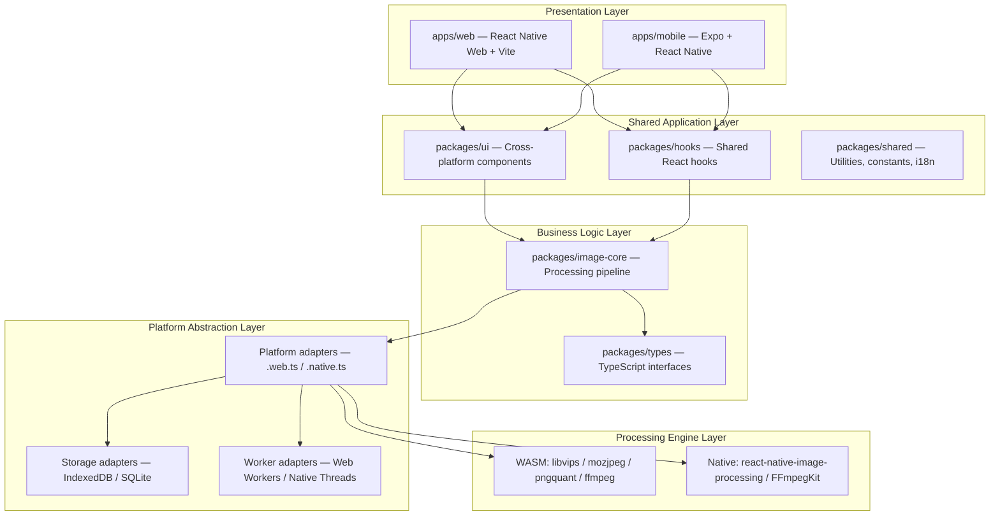
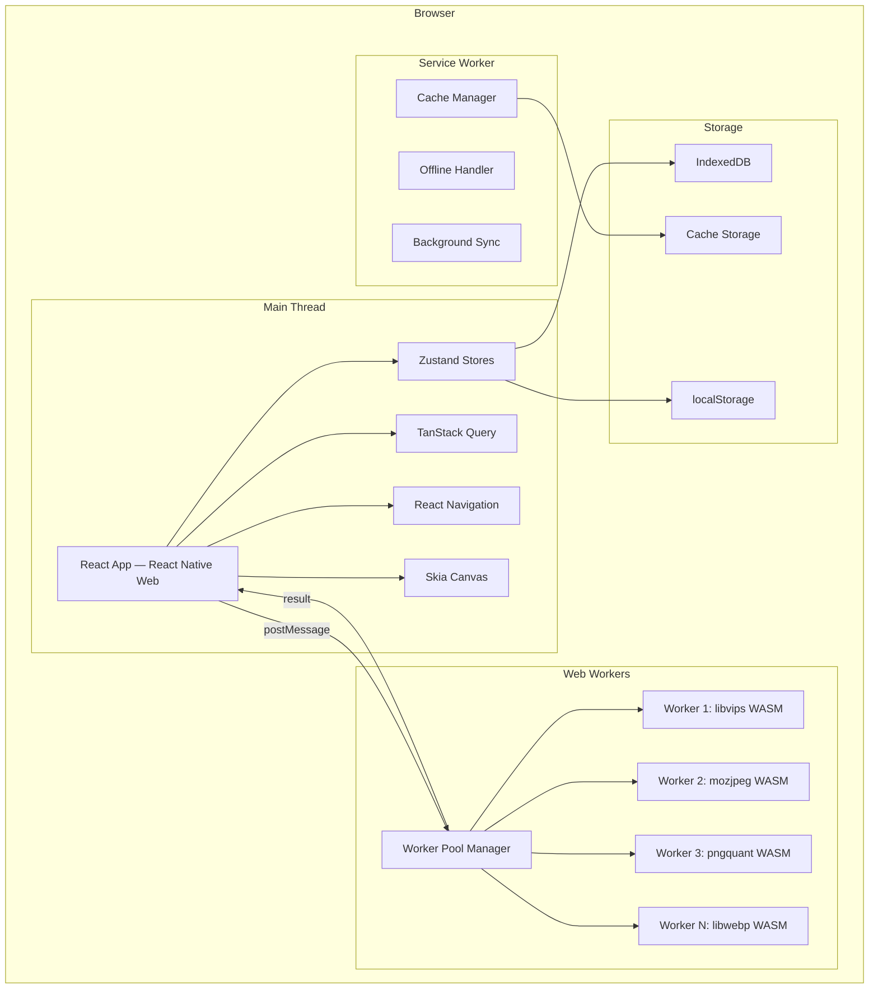
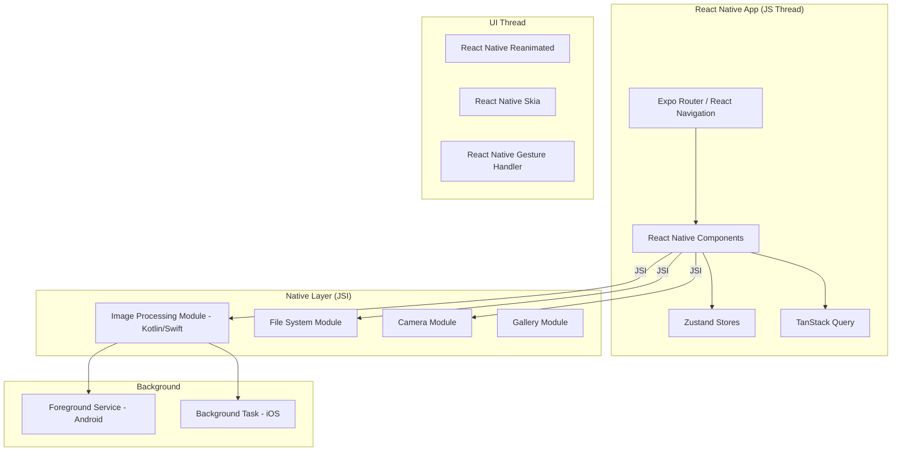
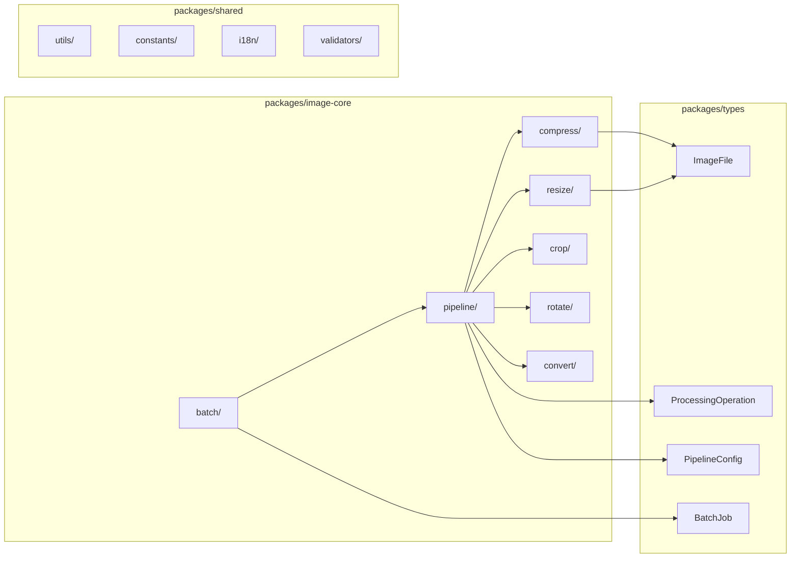
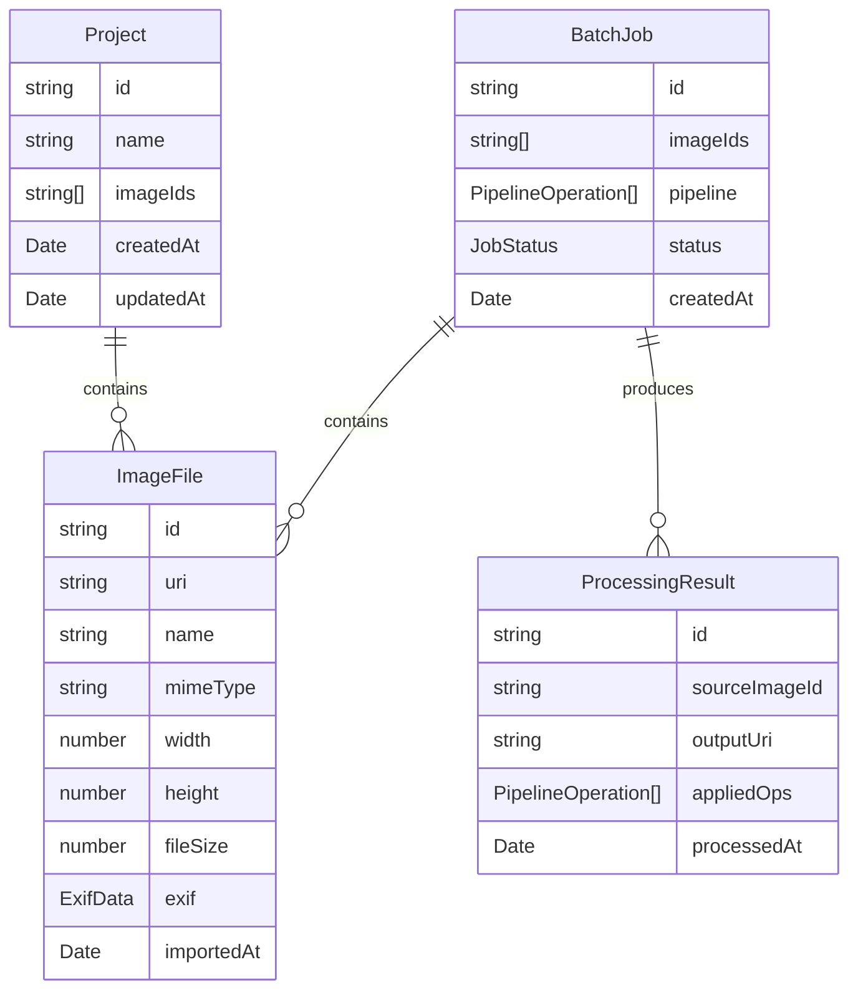
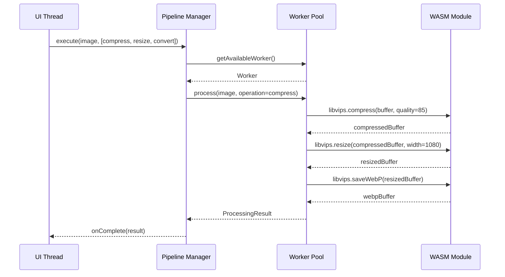
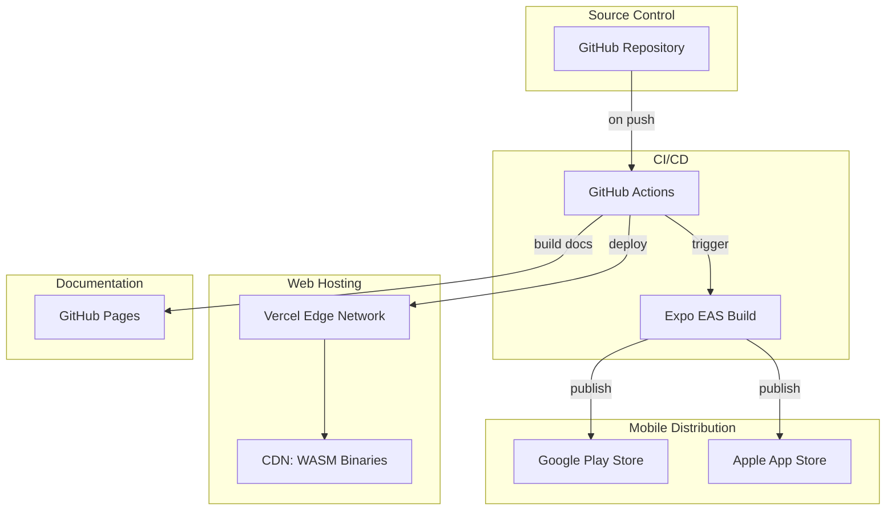

# System Architecture Document

> **Document ID**: 20
> **Phase**: 2 — Architecture
> **Status**: Approved
> **Last Updated**: 2026-07-27
> **Owner**: Architecture Team

---

## Table of Contents

1. [Purpose](#1-purpose)
2. [Scope](#2-scope)
3. [Architectural Goals](#3-architectural-goals)
4. [System Context](#4-system-context)
5. [Architecture Layers](#5-architecture-layers)
6. [Cross-Platform Strategy](#6-cross-platform-strategy)
7. [Web Architecture](#7-web-architecture)
8. [Mobile Architecture](#8-mobile-architecture)
9. [Shared Code Architecture](#9-shared-code-architecture)
10. [Data Architecture](#10-data-architecture)
11. [Processing Architecture](#11-processing-architecture)
12. [Security Architecture Summary](#12-security-architecture-summary)
13. [Deployment Architecture](#13-deployment-architecture)
14. [Architecture Decisions Summary](#14-architecture-decisions-summary)
15. [Architecture Principles](#15-architecture-principles)
16. [Related Documents](#16-related-documents)

---

## 1. Purpose

This System Architecture Document (SAD) is the master architectural reference for ImageForge. It describes the complete system structure, key design decisions, technology choices, and the rationale behind them.

All other architecture documents elaborate on specific aspects described here. When in doubt, this document is the source of architectural truth.

---

## 2. Scope

The entire ImageForge system — Web application, Android application, iOS application, shared packages, build system, and deployment infrastructure.

---

## 3. Architectural Goals

The architecture must satisfy these goals in priority order:

1. **Privacy**: No image data leaves the device without explicit consent
2. **Offline Capability**: Full functionality without internet connection
3. **Cross-Platform Code Sharing**: > 75% shared code between Web and Mobile
4. **Performance**: Processing feels near-instant for common operations
5. **Maintainability**: A new contributor can understand and add a feature within a day
6. **Extensibility**: New features and platforms can be added without rearchitecting

---

## 4. System Context

```mermaid
C4Context
    title ImageForge System Context

    Person(user, "User", "Uploads and processes images")

    System(imageforge_web, "ImageForge Web", "React Native Web PWA — processes images in browser using WASM")
    System(imageforge_mobile, "ImageForge Mobile", "Expo React Native — processes images natively on Android/iOS")

    SystemExt(vercel, "Vercel CDN", "Serves the web application and static assets")
    SystemExt(github, "GitHub", "Source code repository and documentation host")
    SystemExt(play_store, "Google Play Store", "Android app distribution")
    SystemExt(app_store, "Apple App Store", "iOS app distribution")
    SystemExt(eas, "Expo EAS", "Mobile CI/CD build service")
    SystemExt(github_actions, "GitHub Actions", "CI/CD pipeline")

    Rel(user, imageforge_web, "Uses", "HTTPS")
    Rel(user, imageforge_mobile, "Uses", "Native")

    Rel(github_actions, vercel, "Deploys to")
    Rel(github_actions, eas, "Triggers build")
    Rel(eas, play_store, "Publishes to")
    Rel(eas, app_store, "Publishes to")
    Rel(vercel, github, "Pulls code from")
```

**Key observation**: No arrow connects user image data to any external system. All processing is local.

---

## 5. Architecture Layers



### Layer Responsibilities

| Layer                | Responsibility                                  | Changes Frequency |
| -------------------- | ----------------------------------------------- | ----------------- |
| Presentation         | Screen layout, navigation, UI composition       | High              |
| Shared Application   | Reusable components, hooks, utilities           | Medium            |
| Business Logic       | Processing algorithms, validation, domain logic | Low               |
| Platform Abstraction | Platform-specific API adapters                  | Low               |
| Processing Engine    | Actual image processing (WASM/native)           | Very Low          |

---

## 6. Cross-Platform Strategy

### File Extension Convention

```
ComponentName.ts         → Shared (platform-agnostic)
ComponentName.web.ts     → Web-specific implementation
ComponentName.native.ts  → Android + iOS implementation
ComponentName.ios.ts     → iOS-only implementation
ComponentName.android.ts → Android-only implementation
```

Metro (mobile) and Vite (web) resolve these extensions automatically. Business logic in `packages/image-core` is pure TypeScript with no platform extensions — it works on all platforms.

### Shared Code Targets

| Code Type           | Sharing Target | Current Approach                                 |
| ------------------- | -------------- | ------------------------------------------------ |
| Business logic      | 100% shared    | Pure TypeScript in `packages/image-core`         |
| UI components       | 80% shared     | React Native + React Native Web                  |
| State management    | 100% shared    | Zustand (same stores)                            |
| Navigation          | 90% shared     | React Navigation / Expo Router                   |
| Processing pipeline | 100% interface | Platform adapters for engine                     |
| Storage             | 100% interface | IndexedDB adapter (web), SQLite adapter (mobile) |

---

## 7. Web Architecture



### Web Processing Flow

1. User imports image (file picker / drag & drop / clipboard)
2. Image is read as `ArrayBuffer` in the main thread
3. `ArrayBuffer` is transferred (zero-copy) to a free Worker via `postMessage`
4. Worker invokes libvips WASM with the `ArrayBuffer`
5. WASM processes the image
6. Result `ArrayBuffer` is transferred back to main thread
7. Main thread creates a Blob URL for preview/download
8. On download, Blob is offered to the browser's file save dialog

### Key Web Technologies

| Technology       | Purpose                            | Why Chosen                       |
| ---------------- | ---------------------------------- | -------------------------------- |
| React Native Web | Cross-platform component rendering | Code sharing                     |
| Vite             | Web bundler                        | Fast HMR, excellent WASM support |
| Web Workers      | Background image processing        | Non-blocking UI                  |
| IndexedDB        | Queue/project persistence          | Large binary storage             |
| Service Worker   | Offline/PWA                        | Required for PWA compliance      |
| Skia CanvasKit   | Canvas rendering                   | Unified API with mobile Skia     |

---

## 8. Mobile Architecture



### Mobile Processing Flow

1. User selects image from gallery or camera
2. Native module copies image to app's temporary directory
3. Processing request is sent to native processing module via JSI
4. Native module uses libvips (via C FFI) and platform codecs
5. Processed image written to temporary output file
6. JS thread receives file path and updates state
7. User saves to Photos or shares via OS share sheet

---

## 9. Shared Code Architecture



### Processing Pipeline Interface

The core abstraction is the `ProcessingOperation` interface:

```typescript
// packages/types/src/processing.ts
interface ProcessingOperation<TConfig = unknown> {
  readonly type: OperationType;
  readonly config: TConfig;
}

interface ProcessingEngine {
  execute(
    input: ImageFile,
    operations: ProcessingOperation[],
    onProgress?: (progress: number) => void,
  ): Promise<ImageFile>;
}
```

Platform adapters implement `ProcessingEngine`:

- `WasmProcessingEngine` (Web) → calls libvips WASM
- `NativeProcessingEngine` (Mobile) → calls native module via JSI

---

## 10. Data Architecture

### Data Entities



### Storage Strategy

| Data                    | Web               | Mobile            | Persistence                |
| ----------------------- | ----------------- | ----------------- | -------------------------- |
| Image files (originals) | Memory / Blob URL | File system       | Session (cleared on close) |
| Thumbnails              | IndexedDB (Blob)  | File system cache | LRU cache (100 items)      |
| Queue state             | IndexedDB         | SQLite            | Persistent                 |
| Settings                | localStorage      | AsyncStorage      | Persistent                 |
| Project metadata        | IndexedDB         | SQLite            | Persistent                 |
| Processing results      | IndexedDB (temp)  | File system       | Until exported             |

---

## 11. Processing Architecture

### Pipeline Execution Model



### Operations Are Composable

Operations are pure functions (in the logical sense):

```
Input Image → Operation₁ → Intermediate → Operation₂ → Output Image
```

Operations do not mutate the input. Each step produces a new intermediate result, enabling undo/redo.

---

## 12. Security Architecture Summary

Key security properties:

1. **No image transmission**: Enforced by architecture (no HTTP calls for images)
2. **Content Security Policy**: Strict CSP prevents XSS
3. **WASM sandboxing**: WASM runs in browser sandbox, no file system access
4. **Input validation**: MIME type checked by magic bytes before processing
5. **Plugin sandboxing**: Plugins run in isolated iframes/workers

> See [37-security-architecture.md](./37-security-architecture.md) for full security design.

---

## 13. Deployment Architecture



---

## 14. Architecture Decisions Summary

| Decision             | Choice                   | Key Reason                  | ADR      |
| -------------------- | ------------------------ | --------------------------- | -------- |
| Repository structure | Turborepo monorepo       | Atomic changes, shared code | ADR-0001 |
| Web strategy         | React Native Web         | Maximum code sharing        | ADR-0002 |
| State management     | Zustand                  | Simplicity, TypeScript      | ADR-0003 |
| Web image processing | libvips WASM             | Privacy + offline + quality | ADR-0004 |
| Batch engine         | Web Worker pool          | Non-blocking, parallel      | ADR-0005 |
| Plugin system        | Sandboxed iframes        | Security isolation          | ADR-0006 |
| WASM loading         | Lazy + SW cache          | Bundle size                 | ADR-0007 |
| Offline              | Service Worker + Workbox | PWA compliance              | ADR-0008 |
| Mobile platform      | Expo Managed             | OTA, EAS, DX                | ADR-0009 |
| Storage              | IndexedDB / SQLite       | Per-platform optimal        | ADR-0010 |

---

## 15. Architecture Principles

These principles guide all architectural decisions:

1. **Separation of concerns**: UI, business logic, and platform code are strictly separated
2. **Dependency inversion**: High-level modules depend on abstractions, not implementations
3. **Interface segregation**: Platform adapters expose only the minimal interface needed
4. **Open/closed**: Processing operations are open for extension (new operation types) without modifying the pipeline core
5. **Don't Repeat Yourself**: All cross-cutting concerns (error handling, logging, caching) are centralized
6. **Fail fast**: Validation and error detection at the earliest possible point
7. **Explicit over implicit**: Platform-specific code is explicitly named (`.web.ts`, `.native.ts`), never guessed

---

## 16. Related Documents

| Document                                                             | Relationship                      |
| -------------------------------------------------------------------- | --------------------------------- |
| [22-high-level-design.md](./22-high-level-design.md)                 | Expands system diagrams           |
| [23-low-level-design.md](./23-low-level-design.md)                   | Component-level details           |
| [25-monorepo-architecture.md](./25-monorepo-architecture.md)         | Monorepo specifics                |
| [29-image-processing-pipeline.md](./29-image-processing-pipeline.md) | Pipeline details                  |
| [adr/](./adr/)                                                       | All Architecture Decision Records |
| [DECISION_LOG.md](./DECISION_LOG.md)                                 | Decision history                  |

---

_Document Owner: Architecture Team | Review Cycle: Per-major-version | Approved: 2026-07-27_
