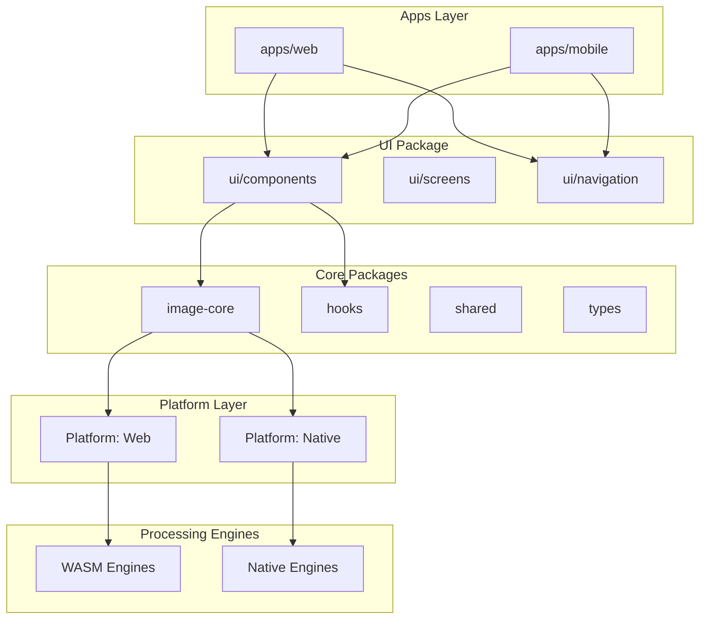
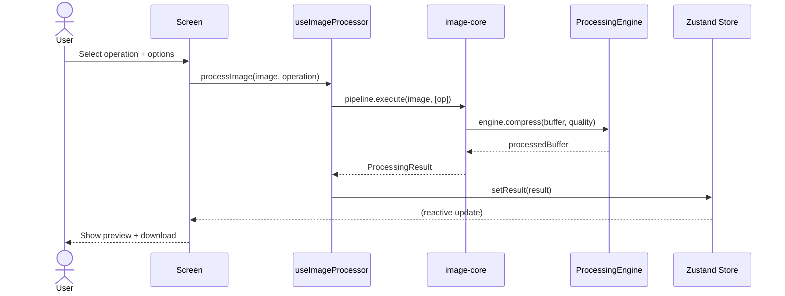

# High-Level Design (HLD)

> **Document ID**: 22
> **Phase**: 2 — Architecture
> **Status**: Approved
> **Last Updated**: 2026-07-27
> **Owner**: Architecture Team

---

## Purpose

This document provides the High-Level Design of ImageForge — the major system components, their responsibilities, and how they interact. It is the technical overview for engineers joining the project.

## Scope

All three platform targets (Web, Android, iOS) at the component level.

---

## System Decomposition



---

## Package Responsibilities

### apps/web

- Vite web application entry point
- Web-specific providers and configuration
- PWA manifest and Service Worker registration
- Web-specific drag & drop and clipboard handlers

### apps/mobile

- Expo entry point
- Expo Router configuration
- Native module Config Plugins
- Mobile-specific permission handlers

### packages/ui

- Cross-platform React Native components
- Shared screens (70% of all screens)
- Navigation configuration (Expo Router)
- Design tokens and theme provider

### packages/image-core

- Processing pipeline orchestration
- Operation implementations (compress, resize, crop, etc.)
- Platform-agnostic business logic
- Processing engine interfaces (implemented per-platform)

### packages/hooks

- `useImageProcessor` — manages processing state
- `useBatchQueue` — queue management
- `useHistory` — undo/redo
- `useStorage` — platform-adaptive storage
- `useSettings` — app preferences

### packages/shared

- Utility functions
- Constants and configuration
- i18n strings
- Validation schemas (Zod)
- Error types

### packages/types

- All TypeScript interfaces and types
- No runtime code — pure types only

---

## Key Component Interactions

### Image Processing Flow



---

## Navigation Architecture

```
Root Navigator (Stack)
├── TabNavigator
│   ├── HomeTab (Import)
│   ├── EditTab (Single image edit)
│   ├── BatchTab (Batch queue)
│   └── SettingsTab
├── ModalNavigator
│   ├── ExportModal
│   ├── HistoryModal
│   └── PluginModal
└── OnboardingNavigator (first launch only)
```

---

## State Architecture

```
Zustand Stores (global)
├── imageStore        → loaded images, active selection
├── queueStore        → batch queue, pipeline config
├── historyStore      → undo/redo stack
├── settingsStore     → user preferences
└── uiStore           → panel visibility, active tool, theme

TanStack Query (async)
├── processing mutations
├── export mutations
└── batch job queries
```

---

## Related Documents

| Document                                                                   | Relationship           |
| -------------------------------------------------------------------------- | ---------------------- |
| [20-system-architecture-document.md](./20-system-architecture-document.md) | Master architecture    |
| [23-low-level-design.md](./23-low-level-design.md)                         | Component internals    |
| [24-component-architecture.md](./24-component-architecture.md)             | UI component hierarchy |
| [26-package-architecture.md](./26-package-architecture.md)                 | Package details        |

---

_Document Owner: Architecture Team | Approved: 2026-07-27_
