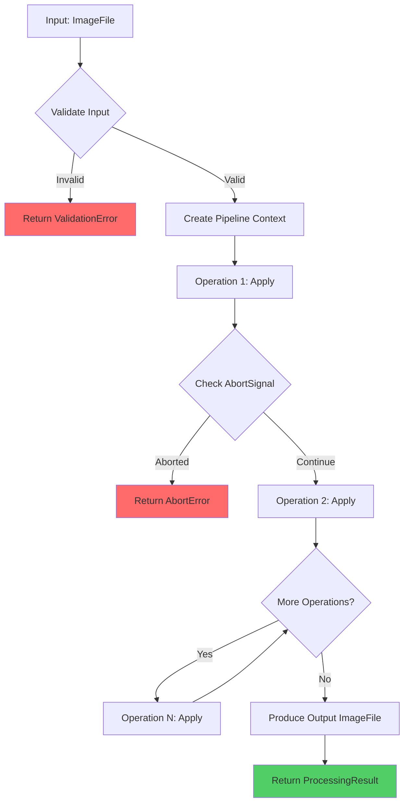

# Image Processing Pipeline

> **Document ID**: 29
> **Phase**: 2 — Architecture
> **Status**: Approved
> **Last Updated**: 2026-07-27
> **Owner**: Architecture Team

---

## Purpose

This document details the design of ImageForge's core image processing pipeline — the mechanism by which image operations are defined, composed, validated, and executed across Web and Mobile platforms.

---

## Pipeline Design Principles

1. **Composability**: Operations chain without modifying each other's code
2. **Immutability**: Each operation receives a copy; originals never mutated
3. **Platform Agnosticism**: The pipeline orchestrator knows nothing about WASM or native — it delegates to a `ProcessingEngine`
4. **Testability**: Each operation is a pure function testable in isolation
5. **Cancellability**: Any in-progress pipeline can be aborted via AbortSignal

---

## Core Types

```typescript
// packages/types/src/pipeline.ts

type OperationType =
  | 'compress'
  | 'resize'
  | 'crop'
  | 'rotate'
  | 'flip'
  | 'convert'
  | 'filter'
  | 'enhance'
  | 'watermark'
  | 'blur'
  | 'metadata-strip';

interface ProcessingOperation<TConfig = unknown> {
  readonly id: string; // UUID for this operation instance
  readonly type: OperationType;
  readonly config: TConfig;
}

interface CompressConfig {
  readonly codec: 'jpeg' | 'webp' | 'png';
  readonly quality: number; // 1-100 for lossy; 0-9 for PNG
  readonly targetSizeKb?: number; // adaptive compression target
}

interface ResizeConfig {
  readonly width?: number;
  readonly height?: number;
  readonly mode: 'fit' | 'fill' | 'crop' | 'stretch';
  readonly algorithm: 'lanczos3' | 'bicubic' | 'nearest';
}

interface ImageFile {
  readonly id: string;
  readonly buffer: ArrayBuffer; // Raw image data
  readonly mimeType: string;
  readonly width: number;
  readonly height: number;
  readonly fileSize: number;
  readonly metadata?: ExifData;
}

interface ProcessingResult {
  readonly output: ImageFile;
  readonly appliedOperations: ProcessingOperation[];
  readonly processingTimeMs: number;
  readonly error?: ProcessingError;
}
```

---

## Pipeline Execution



### Pipeline Orchestrator

```typescript
// packages/image-core/src/pipeline/Pipeline.ts

class ImagePipeline {
  constructor(
    private readonly engine: ProcessingEngine,
    private readonly operations: ProcessingOperation[],
  ) {}

  async execute(
    input: ImageFile,
    signal?: AbortSignal,
    onProgress?: (step: number, total: number) => void,
  ): Promise<ProcessingResult> {
    let current = input;
    const total = this.operations.length;
    const startTime = performance.now();

    for (let i = 0; i < this.operations.length; i++) {
      if (signal?.aborted) {
        throw new ProcessingError('ABORTED', 'Operation aborted by user');
      }

      onProgress?.(i, total);
      current = await this.engine.applyOperation(current, this.operations[i]);
    }

    return {
      output: current,
      appliedOperations: this.operations,
      processingTimeMs: performance.now() - startTime,
    };
  }
}
```

---

## Processing Engine Interface

```typescript
// packages/image-core/src/engines/ProcessingEngine.ts

interface ProcessingEngine {
  initialize(): Promise<void>;
  isReady(): boolean;

  applyOperation(input: ImageFile, operation: ProcessingOperation): Promise<ImageFile>;

  dispose(): void;
}
```

### Platform Implementations

```
ProcessingEngine (interface)
├── WasmProcessingEngine (web.ts)
│   ├── Dispatches to Web Worker
│   ├── Translates operations to libvips/mozjpeg calls
│   └── Handles WASM initialization
│
└── NativeProcessingEngine (native.ts)
    ├── Calls through JSI to native module
    ├── Translates operations to iOS/Android API calls
    └── Handles native thread management
```

---

## Operation Implementations

Each operation type has a corresponding implementation per platform:

### Compress Operation (Web — WASM)

```
compress(buffer, quality=85, codec='jpeg')
    → Call mozjpeg.encode(buffer, quality)    [for JPEG]
    → Call libwebp.encode(buffer, quality)    [for WebP]
    → Call pngquant.encode(buffer)            [for PNG lossless]
```

### Adaptive Compression (Target File Size)

Binary search algorithm:

1. Start with quality = 85
2. Compress and check output size
3. If too large: quality -= step; if too small: quality += step
4. Converge until within ±10% of target
5. Maximum 10 iterations

---

## Undo/Redo Integration

The pipeline integrates with the history system:

```
User applies operation
    ↓
Pipeline executes operation → ProcessingResult
    ↓
History store records: {
    operation: AppliedOperation,
    snapshot: ImageFile  // before state
}
    ↓
User presses Undo
    ↓
History store pops snapshot → restores previous ImageFile
```

Snapshots are stored in memory (not persisted). The undo history is bounded by available memory (estimated at ~10 full-resolution snapshots for a 12MP image).

---

## Batch Pipeline

The batch engine uses the same `ImagePipeline` class:

```
BatchQueue (N images)
    ↓
For each image:
    ImagePipeline.execute(image, sharedPipelineOperations)
    → Processed image → Export
```

Each image in the batch runs the full pipeline independently. Results are produced sequentially per worker (each worker processes one image at a time).

---

## Error Handling

```typescript
class ProcessingError extends Error {
  constructor(
    public readonly code: ProcessingErrorCode,
    message: string,
    public readonly cause?: unknown,
  ) {
    super(message);
    this.name = 'ProcessingError';
  }
}

type ProcessingErrorCode =
  | 'INVALID_INPUT'
  | 'UNSUPPORTED_FORMAT'
  | 'WASM_NOT_INITIALIZED'
  | 'OUT_OF_MEMORY'
  | 'ABORTED'
  | 'ENCODE_FAILED'
  | 'DECODE_FAILED';
```

---

## Related Documents

| Document                                                         | Relationship              |
| ---------------------------------------------------------------- | ------------------------- |
| [30-batch-processing-engine.md](./30-batch-processing-engine.md) | Batch orchestration       |
| [49b-wasm-architecture.md](./49b-wasm-architecture.md)           | WASM engine details       |
| [49-native-bridge-design.md](./49-native-bridge-design.md)       | Native engine bridge      |
| [39-error-handling-strategy.md](./39-error-handling-strategy.md) | Error handling patterns   |
| [35-state-management.md](./35-state-management.md)               | History state integration |

---

_Document Owner: Architecture Team | Approved: 2026-07-27_
