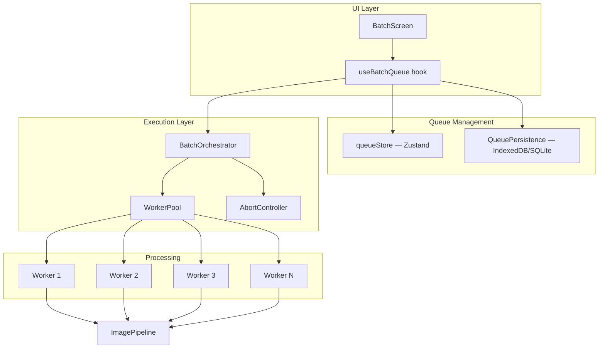
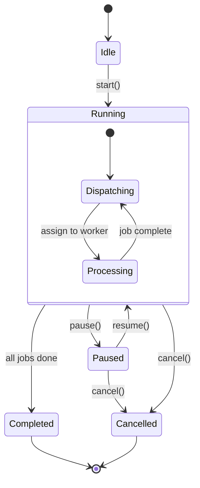

# Batch Processing Engine

> **Document ID**: 30
> **Phase**: 2 — Architecture
> **Status**: Approved
> **Last Updated**: 2026-07-27
> **Owner**: Architecture Team

---

## Purpose

This document details the design of ImageForge's batch processing engine — the system that manages concurrent image processing of multiple images with queue persistence, cancellation, progress tracking, and retry capabilities.

---

## Architecture Overview



---

## Core Data Structures

```typescript
// packages/types/src/batch.ts

type JobStatus = 'pending' | 'processing' | 'completed' | 'failed' | 'cancelled' | 'retrying';

interface BatchJob {
  readonly id: string; // UUID
  readonly imageId: string; // Reference to source image
  readonly imageFile: ImageFile; // Image data (for processing)
  status: JobStatus;
  progress: number; // 0-100
  error?: string;
  startedAt?: number;
  completedAt?: number;
  result?: ProcessingResult;
  retryCount: number;
}

interface BatchQueue {
  readonly id: string;
  jobs: BatchJob[];
  pipeline: ProcessingOperation[];
  status: 'idle' | 'running' | 'paused' | 'completed' | 'cancelled';
  createdAt: number;
  completedAt?: number;
}
```

---

## Queue State Machine



---

## BatchOrchestrator

```typescript
// packages/image-core/src/batch/BatchOrchestrator.ts

class BatchOrchestrator {
  private abortController = new AbortController();
  private workerPool: WasmWorkerPool;

  async run(
    queue: BatchQueue,
    onJobUpdate: (jobId: string, update: Partial<BatchJob>) => void,
  ): Promise<void> {
    const pendingJobs = queue.jobs.filter((j) => j.status === 'pending' || j.status === 'retrying');

    // Process jobs with bounded concurrency
    await this.processWithConcurrency(pendingJobs, onJobUpdate);
  }

  private async processWithConcurrency(
    jobs: BatchJob[],
    onUpdate: (id: string, update: Partial<BatchJob>) => void,
  ): Promise<void> {
    // Use a semaphore to limit concurrency to worker pool size
    const semaphore = new Semaphore(this.workerPool.size);

    await Promise.all(jobs.map((job) => semaphore.run(() => this.processJob(job, onUpdate))));
  }

  private async processJob(
    job: BatchJob,
    onUpdate: (id: string, update: Partial<BatchJob>) => void,
  ): Promise<void> {
    if (this.abortController.signal.aborted) return;

    onUpdate(job.id, { status: 'processing', startedAt: Date.now() });

    try {
      const pipeline = new ImagePipeline(this.workerPool, job.pipeline);

      const result = await pipeline.execute(
        job.imageFile,
        this.abortController.signal,
        (step, total) => onUpdate(job.id, { progress: (step / total) * 100 }),
      );

      onUpdate(job.id, {
        status: 'completed',
        result,
        progress: 100,
        completedAt: Date.now(),
      });
    } catch (error) {
      const isAbort = error instanceof Error && error.name === 'AbortError';
      onUpdate(job.id, {
        status: isAbort ? 'cancelled' : 'failed',
        error: isAbort ? undefined : formatError(error),
      });
    }
  }

  pause(): void {
    // Complete current jobs, don't start new ones
    // Handled by queue store status check in processWithConcurrency
  }

  cancel(): void {
    this.abortController.abort();
  }
}
```

---

## Queue Persistence

The queue is persisted to survive page refresh and app restart:

### Web (IndexedDB via Dexie)

```typescript
// Storage schema
db.version(1).stores({
  queues: '++id, status, createdAt',
  jobs: '++id, queueId, status, imageId',
});

// Auto-persist on every job update
queueStore.subscribe(
  (state) => state.jobs,
  async (jobs) => {
    await db.jobs.bulkPut(Array.from(jobs.values()));
  },
);
```

### Session Restore

On app start:

1. Query IndexedDB for any queue with status `running` or `paused`
2. If found, show "Resume previous session?" prompt
3. If user confirms, restore queue state and resume

---

## Output File Naming

Configurable output naming templates:

| Template                | Example                |
| ----------------------- | ---------------------- |
| `{original}`            | `photo.jpg`            |
| `{original}-compressed` | `photo-compressed.jpg` |
| `{original}-{date}`     | `photo-2026-07-27.jpg` |
| `{index:04d}`           | `0001.jpg`             |
| `output-{index}`        | `output-1.jpg`         |

---

## Progress Events

```typescript
interface BatchProgressEvent {
  type: 'job-started' | 'job-progress' | 'job-completed' | 'job-failed' | 'batch-completed';
  jobId?: string;
  progress?: number; // 0-100 for job progress
  totalProgress?: number; // 0-100 for overall batch
  completedCount: number;
  failedCount: number;
  totalCount: number;
}
```

---

## Related Documents

| Document                                                             | Relationship          |
| -------------------------------------------------------------------- | --------------------- |
| [29-image-processing-pipeline.md](./29-image-processing-pipeline.md) | Pipeline used per job |
| [32-background-job-system.md](./32-background-job-system.md)         | Background execution  |
| [33-storage-architecture.md](./33-storage-architecture.md)           | Queue persistence     |
| [35-state-management.md](./35-state-management.md)                   | queueStore definition |
| [49b-wasm-architecture.md](./49b-wasm-architecture.md)               | Worker pool           |

---

_Document Owner: Architecture Team | Approved: 2026-07-27_
