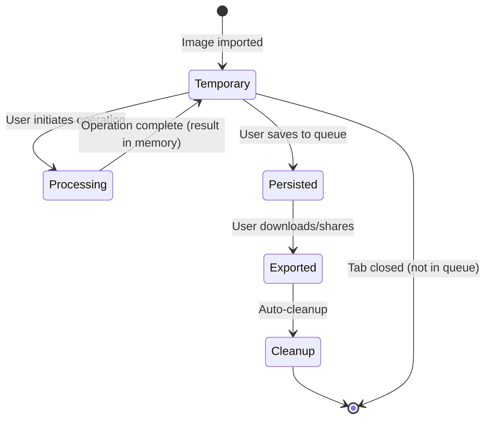

# Storage Architecture

> **Document ID**: 33
> **Phase**: 2 — Architecture
> **Status**: Approved
> **Last Updated**: 2026-07-27
> **Owner**: Architecture Team

---

## Purpose

This document defines the complete storage architecture for ImageForge across Web (IndexedDB) and Mobile (SQLite + File System) platforms, including schema design, adapter interface, migration strategy, and quota management.

---

## Storage Adapter Interface

```typescript
// packages/types/src/storage.ts

interface StorageAdapter {
  // Queue persistence
  saveQueue(queue: BatchQueue): Promise<void>;
  loadQueue(id: string): Promise<BatchQueue | null>;
  loadActiveQueues(): Promise<BatchQueue[]>;
  deleteQueue(id: string): Promise<void>;

  // Settings
  saveSetting(key: string, value: unknown): Promise<void>;
  loadSetting<T>(key: string, defaultValue: T): Promise<T>;

  // Thumbnails
  saveThumbnail(imageId: string, blob: Blob): Promise<void>;
  loadThumbnail(imageId: string): Promise<Blob | null>;
  clearThumbnailCache(): Promise<void>;

  // Storage info
  getStorageUsage(): Promise<StorageUsage>;
  clearAll(): Promise<void>;
}

interface StorageUsage {
  usedBytes: number;
  quotaBytes: number;
  breakdown: {
    queues: number;
    thumbnails: number;
    settings: number;
  };
}
```

---

## Web: IndexedDB Schema (Dexie.js)

```typescript
// packages/image-core/src/storage/web/WebStorageAdapter.ts

class ImageForgeDatabase extends Dexie {
  queues!: Table<SerializedBatchQueue>;
  jobs!: Table<SerializedBatchJob>;
  thumbnails!: Table<{ imageId: string; blob: Blob; createdAt: number }>;
  keyval!: Table<{ key: string; value: unknown }>;

  constructor() {
    super('ImageForgeDB');

    this.version(1).stores({
      queues: 'id, status, createdAt',
      jobs: 'id, queueId, status, imageId',
      thumbnails: 'imageId, createdAt',
      keyval: 'key',
    });
  }
}
```

### Schema Migrations

```typescript
// Version 2: Add projectId to queues
this.version(2)
  .stores({
    queues: 'id, status, createdAt, projectId',
    // ... other tables unchanged
  })
  .upgrade((tx) => {
    return tx.queues.toCollection().modify((queue) => {
      queue.projectId = null; // Default for existing records
    });
  });
```

---

## Mobile: SQLite Schema

```sql
-- expo-sqlite schema
CREATE TABLE IF NOT EXISTS queues (
    id TEXT PRIMARY KEY,
    status TEXT NOT NULL,
    pipeline TEXT NOT NULL,    -- JSON serialized
    created_at INTEGER NOT NULL,
    completed_at INTEGER
);

CREATE TABLE IF NOT EXISTS jobs (
    id TEXT PRIMARY KEY,
    queue_id TEXT NOT NULL,
    image_id TEXT NOT NULL,
    status TEXT NOT NULL,
    progress REAL DEFAULT 0,
    error TEXT,
    started_at INTEGER,
    completed_at INTEGER,
    retry_count INTEGER DEFAULT 0,
    FOREIGN KEY (queue_id) REFERENCES queues(id) ON DELETE CASCADE
);

CREATE TABLE IF NOT EXISTS settings (
    key TEXT PRIMARY KEY,
    value TEXT NOT NULL    -- JSON serialized
);

CREATE INDEX idx_jobs_queue_id ON jobs(queue_id);
CREATE INDEX idx_jobs_status ON jobs(status);
```

---

## Storage Quota Management

### Web

Browser IndexedDB quotas vary by browser and available storage:

- Chrome: up to 80% of disk space
- Safari: 1GB per origin (configurable by user)
- Firefox: up to 50% of disk space

Strategy:

```typescript
async function checkAndManageQuota(db: ImageForgeDatabase): Promise<void> {
  if ('storage' in navigator && 'estimate' in navigator.storage) {
    const { usage, quota } = await navigator.storage.estimate();
    const usagePercent = (usage! / quota!) * 100;

    if (usagePercent > 80) {
      // Evict oldest thumbnails (LRU)
      const oldThumbnails = await db.thumbnails.orderBy('createdAt').limit(50).toArray();
      await db.thumbnails.bulkDelete(oldThumbnails.map((t) => t.imageId));
    }
  }
}
```

### Mobile

Mobile storage is file system based. Temporary processing files are cleaned up after export:

```typescript
// Cleanup after export
async function cleanupTempFiles(imageId: string): Promise<void> {
  const tempDir = `${FileSystem.cacheDirectory}imageforge/${imageId}/`;
  await FileSystem.deleteAsync(tempDir, { idempotent: true });
}
```

---

## Data Lifecycle



---

## Privacy Compliance

1. **No image data persisted by default**: Original image ArrayBuffers are NOT stored in IndexedDB — only metadata and thumbnails (resized, privacy-safe previews)
2. **Thumbnails are lossy resized copies**: Max 300×300px, not the original data
3. **Clear All function**: `StorageAdapter.clearAll()` removes every record from every table
4. **Export-and-forget**: Processing results are held in memory until export, then garbage-collected

---

## Related Documents

| Document                                                               | Relationship               |
| ---------------------------------------------------------------------- | -------------------------- |
| [ADR-0010](./adr/ADR-0010-storage.md)                                  | Storage decision rationale |
| [30-batch-processing-engine.md](./30-batch-processing-engine.md)       | Queue persistence consumer |
| [38-offline-first-architecture.md](./38-offline-first-architecture.md) | Offline storage strategy   |

---

_Document Owner: Architecture Team | Approved: 2026-07-27_
