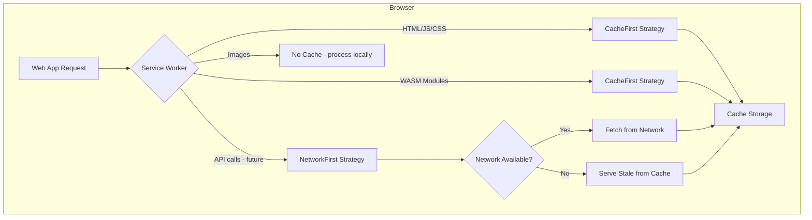

# Offline-First Architecture

> **Document ID**: 38
> **Phase**: 2 — Architecture
> **Status**: Approved
> **Last Updated**: 2026-07-27
> **Owner**: Architecture Team

---

## Purpose

This document defines ImageForge's offline-first architecture — how the application is designed to function fully without an internet connection after its initial load, across both Web and Mobile platforms.

---

## Offline-First Principle

Offline capability is not a feature — it is an architectural constraint. Every design decision must consider: "Does this work when there is no network?"

Specifically:

1. Image processing must work offline (all processing is local)
2. The web app must be usable after initial load (Service Worker cache)
3. Queue state persists across sessions (IndexedDB / SQLite)
4. No features silently fail offline — they either work or show a clear offline message

---

## Web: Service Worker Architecture



### Workbox Configuration

```typescript
// apps/web/src/sw.ts (Service Worker)
import { precacheAndRoute, cleanupOutdatedCaches } from 'workbox-precaching';
import { registerRoute } from 'workbox-routing';
import { CacheFirst, NetworkFirst, StaleWhileRevalidate } from 'workbox-strategies';
import { ExpirationPlugin } from 'workbox-expiration';

// Precache all static assets at build time
precacheAndRoute(self.__WB_MANIFEST);
cleanupOutdatedCaches();

// WASM modules — CacheFirst (versioned URLs)
registerRoute(
  ({ url }) => url.pathname.endsWith('.wasm'),
  new CacheFirst({
    cacheName: 'wasm-cache-v1',
    plugins: [
      new ExpirationPlugin({
        maxAgeSeconds: 30 * 24 * 60 * 60, // 30 days
      }),
    ],
  }),
);

// Google Fonts
registerRoute(
  ({ url }) => url.hostname === 'fonts.gstatic.com',
  new StaleWhileRevalidate({
    cacheName: 'fonts-cache',
  }),
);
```

### PWA Offline Fallback

When the user navigates to the app without network:

1. Service Worker serves the cached HTML shell
2. React app loads from cached JS bundle
3. WASM loaded from SW cache
4. IndexedDB restores queue state
5. App is fully functional

---

## Mobile: Offline Capability

Mobile apps are inherently offline-first:

- All app code is bundled in the APK/IPA
- No runtime network requests needed for core functionality
- OTA (Over-the-Air) updates via EAS Update require network (background, non-blocking)
- SQLite database is local — no sync needed

### What Requires Network (Mobile)

| Feature          | Network Required? | Offline Behavior         |
| ---------------- | ----------------- | ------------------------ |
| Core processing  | No                | ✅ Works                 |
| Gallery import   | No                | ✅ Works                 |
| Camera capture   | No                | ✅ Works                 |
| Save to Photos   | No                | ✅ Works                 |
| Share            | No                | ✅ Works                 |
| OTA update check | Yes               | 🔕 Silently skipped      |
| Analytics ping   | Yes               | 🔕 Queued for later      |
| Plugin download  | Yes               | ❌ Offline warning shown |

---

## Offline State Detection

```typescript
// packages/hooks/src/useNetworkStatus.ts

function useNetworkStatus() {
  const [isOnline, setIsOnline] = useState(
    typeof navigator !== 'undefined' ? navigator.onLine : true,
  );

  useEffect(() => {
    const handleOnline = () => setIsOnline(true);
    const handleOffline = () => setIsOnline(false);

    window.addEventListener('online', handleOnline);
    window.addEventListener('offline', handleOffline);

    return () => {
      window.removeEventListener('online', handleOnline);
      window.removeEventListener('offline', handleOffline);
    };
  }, []);

  return isOnline;
}
```

Offline status is shown in a non-intrusive banner: "You're offline — image processing still works."

---

## Cache Invalidation Strategy

When a new version of ImageForge is deployed:

1. Vite generates new content-hashed asset URLs (e.g., `app.a1b2c3.js`)
2. Service Worker's precache manifest updates
3. On next visit, SW installs new assets in the background
4. User sees a "New version available" toast with "Reload" button
5. On reload, SW activates the new version

```typescript
// Notify app when SW has a new version ready
navigator.serviceWorker.addEventListener('controllerchange', () => {
  useUIStore.getState().addToast({
    type: 'info',
    title: 'Update Available',
    message: 'A new version of ImageForge is ready.',
    action: { label: 'Reload', onClick: () => window.location.reload() },
    persistent: true,
  });
});
```

---

## Related Documents

| Document                                                   | Relationship             |
| ---------------------------------------------------------- | ------------------------ |
| [ADR-0008](./adr/ADR-0008-offline-first.md)                | Workbox decision         |
| [33-storage-architecture.md](./33-storage-architecture.md) | Offline data persistence |
| [49b-wasm-architecture.md](./49b-wasm-architecture.md)     | WASM caching             |
| [80-ci-cd.md](./80-ci-cd.md)                               | Build configuration      |

---

_Document Owner: Architecture Team | Approved: 2026-07-27_
