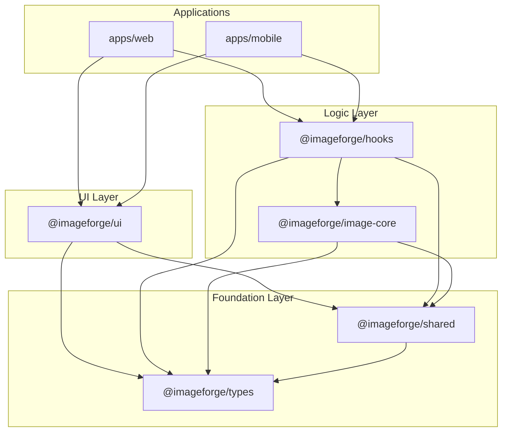

# Dependency Graph

> **Document ID**: 41
> **Phase**: 2 — Architecture
> **Status**: Approved
> **Last Updated**: 2026-07-27
> **Owner**: Architecture Team

---

## Purpose

This document maps the dependency relationships within the ImageForge monorepo, including internal package dependencies, critical external dependencies, and the rationale for each.

---

## Internal Package Dependency Graph

**Rules**:

- No circular dependencies (enforced by ESLint `import/no-cycle`)
- Apps may depend on any package
- Packages may NOT depend on apps
- Foundation packages (`shared`, `types`) have no `@imageforge/*` dependencies

---

## External Dependencies by Package

### apps/web

| Dependency             | Version | Purpose                   | License |
| ---------------------- | ------- | ------------------------- | ------- |
| `vite`                 | ^5.x    | Web bundler               | MIT     |
| `vite-plugin-pwa`      | ^0.19   | Service Worker generation | MIT     |
| `@vitejs/plugin-react` | ^4.x    | React transform           | MIT     |

### @imageforge/ui

| Dependency                     | Version | Purpose               | License |
| ------------------------------ | ------- | --------------------- | ------- |
| `react-native`                 | ^0.74   | Core framework        | MIT     |
| `react-native-web`             | ^0.19   | Web rendering         | MIT     |
| `expo`                         | ~51.x   | SDK                   | MIT     |
| `expo-router`                  | ~3.x    | File-based navigation | MIT     |
| `react-native-reanimated`      | ^3.x    | Smooth animations     | MIT     |
| `@shopify/react-native-skia`   | ^1.x    | Canvas rendering      | MIT     |
| `react-native-gesture-handler` | ^2.x    | Gesture system        | MIT     |
| `@shopify/flash-list`          | ^1.x    | Performant lists      | MIT     |

### @imageforge/image-core

| Dependency         | Version | Purpose                    | License    |
| ------------------ | ------- | -------------------------- | ---------- |
| `dexie`            | ^3.x    | IndexedDB wrapper (web)    | Apache-2.0 |
| `expo-file-system` | ~17.x   | File operations (mobile)   | MIT        |
| `expo-sqlite`      | ~14.x   | SQLite (mobile)            | MIT        |
| `jszip`            | ^3.x    | ZIP creation (web)         | MIT        |
| `fflate`           | ^0.8    | Fast compression (ZIP alt) | MIT        |

### @imageforge/shared

| Dependency              | Version | Purpose                 | License |
| ----------------------- | ------- | ----------------------- | ------- |
| `zustand`               | ^4.x    | State management        | MIT     |
| `@tanstack/react-query` | ^5.x    | Async state             | MIT     |
| `zod`                   | ^3.x    | Schema validation       | MIT     |
| `immer`                 | ^10.x   | Immutable state updates | MIT     |

---

## WASM Module Dependencies

| Module     | Source            | Size (gz) | License   |
| ---------- | ----------------- | --------- | --------- |
| `libvips`  | libvips project   | ~3.5MB    | LGPL-2.1  |
| `mozjpeg`  | Mozilla           | ~300KB    | BSD / MPL |
| `pngquant` | pngquant.org      | ~200KB    | GPLv3     |
| `libwebp`  | Google            | ~400KB    | BSD       |
| `libavif`  | Netflix / AOMedia | ~600KB    | BSD       |
| `libheif`  | Struktur AG       | ~800KB    | LGPL      |
| `ffmpeg`   | FFmpeg project    | ~7MB      | LGPL      |

> ⚠️ **License Note**: `pngquant` is GPLv3. If ImageForge is ever compiled into a proprietary product, pngquant must be replaced with an alternative (e.g., oxipng, which is MIT). For open-source ImageForge, GPLv3 is acceptable.

---

## Forbidden Dependencies

| Package            | Reason                                                |
| ------------------ | ----------------------------------------------------- |
| `moment`           | Replaced by `date-fns` (smaller, tree-shakeable)      |
| `lodash`           | Use native ES methods or specific `lodash-es` imports |
| `axios`            | Use native `fetch` — simpler, no extra dep            |
| Any analytics SDK  | Only allowed if user opt-in is implemented first      |
| Any tracking pixel | Never — privacy by design                             |

---

## Dependency Review Process

1. All new dependencies require a PR comment explaining: purpose, license, size impact
2. `npm audit` runs in CI — high/critical CVEs block merge
3. License checker (`license-checker`) runs in CI — GPL/AGPL in non-WASM code blocked
4. Dependabot creates weekly PRs for dependency updates

---

## Related Documents

| Document                                                     | Relationship          |
| ------------------------------------------------------------ | --------------------- |
| [77-third-party-libraries.md](./77-third-party-libraries.md) | Library rationale     |
| [37-security-architecture.md](./37-security-architecture.md) | Supply chain security |
| [25-monorepo-architecture.md](./25-monorepo-architecture.md) | Package structure     |

---

_Document Owner: Architecture Team | Review Cycle: Monthly | Approved: 2026-07-27_
