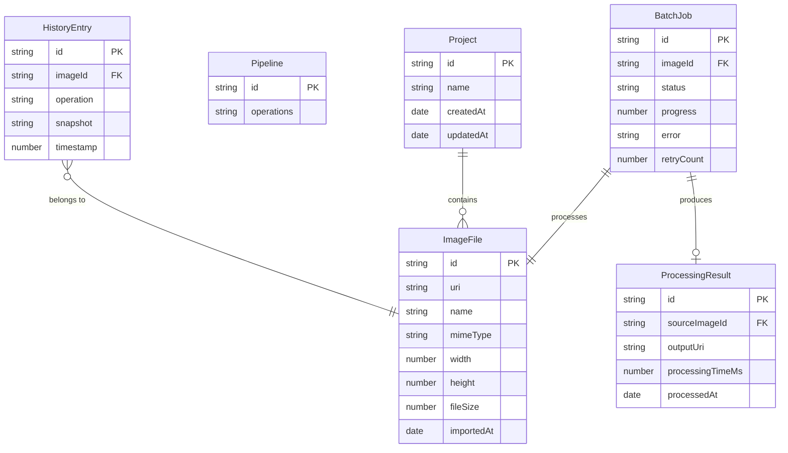

# Domain Model

> **Document ID**: 42
> **Phase**: 2 — Architecture
> **Status**: Approved
> **Last Updated**: 2026-07-27
> **Owner**: Architecture Team

---

## Purpose

This document defines the domain model for ImageForge — the entities, value objects, aggregates, and their relationships that represent the business domain.

---

## Domain Entities

### ImageFile

The central domain entity. Represents a loaded image.

```typescript
interface ImageFile {
  readonly id: string; // UUID
  readonly uri: string; // Local URI / Blob URL
  readonly buffer: ArrayBuffer; // Raw image data
  readonly name: string; // Original filename
  readonly mimeType: string; // 'image/jpeg', etc.
  readonly width: number; // Pixels
  readonly height: number; // Pixels
  readonly fileSize: number; // Bytes
  readonly colorSpace: ColorSpace;
  readonly exif: ExifData | null;
  readonly importedAt: Date;
  readonly isDuplicate: boolean;
}
```

### BatchJob

Represents one image in a processing queue.

```typescript
interface BatchJob {
  readonly id: string;
  readonly imageId: string;
  status: JobStatus;
  progress: number; // 0-100
  error: string | null;
  startedAt: Date | null;
  completedAt: Date | null;
  retryCount: number;
  result: ProcessingResult | null;
}
```

### ProcessingOperation (Value Object)

An immutable description of one processing step.

```typescript
type ProcessingOperation =
  | { type: 'compress'; config: CompressConfig }
  | { type: 'resize'; config: ResizeConfig }
  | { type: 'crop'; config: CropConfig }
  | { type: 'rotate'; config: RotateConfig }
  | { type: 'flip'; config: FlipConfig }
  | { type: 'convert'; config: ConvertConfig }
  | { type: 'filter'; config: FilterConfig }
  | { type: 'enhance'; config: EnhanceConfig }
  | { type: 'watermark'; config: WatermarkConfig }
  | { type: 'metadata-strip'; config: MetadataStripConfig };
```

### Pipeline

An ordered sequence of ProcessingOperations applied to an image.

```typescript
interface Pipeline {
  readonly id: string;
  readonly operations: ProcessingOperation[];
}
```

### Project (Phase 2)

A named workspace of images.

```typescript
interface Project {
  readonly id: string;
  readonly name: string;
  readonly imageIds: string[];
  readonly pipeline: Pipeline | null;
  readonly createdAt: Date;
  readonly updatedAt: Date;
}
```

---

## Entity Relationship Diagram



---

## Aggregates

### Image Aggregate

Root: `ImageFile`
Members: `HistoryEntry[]` (for this image's edit history)

### Queue Aggregate

Root: `BatchQueue`
Members: `BatchJob[]`, `Pipeline`

---

## Value Objects

| Object             | Description                       |
| ------------------ | --------------------------------- |
| `CompressConfig`   | Quality, codec, target size       |
| `ResizeConfig`     | Dimensions, mode, algorithm       |
| `CropConfig`       | x, y, width, height, aspect ratio |
| `RotateConfig`     | Angle, expand canvas              |
| `ExifData`         | GPS, camera, exposure data        |
| `ProcessingResult` | Output image, timing, applied ops |

---

_Document Owner: Architecture Team | Approved: 2026-07-27_
