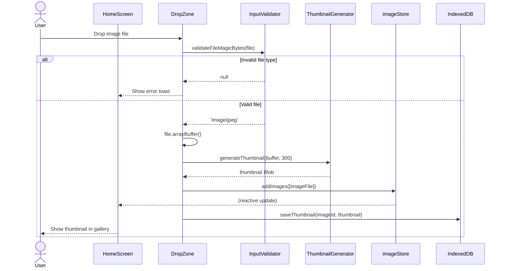
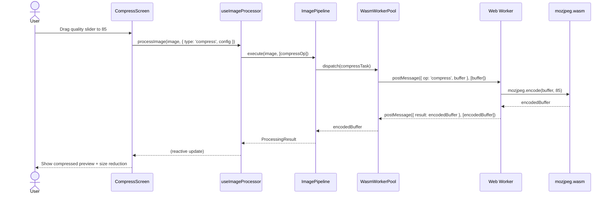
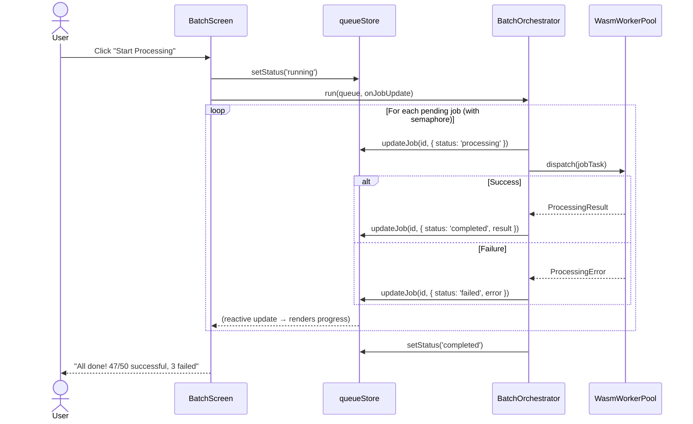
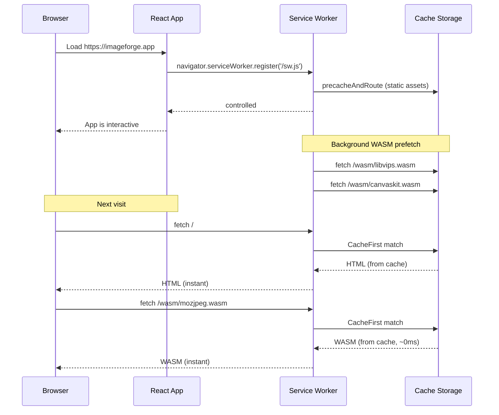
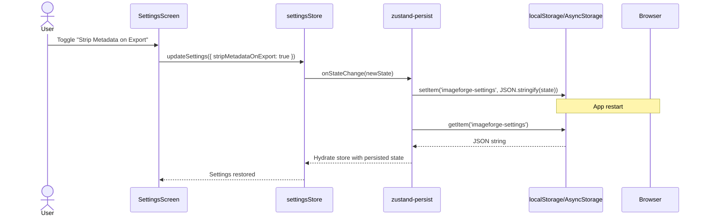

# Sequence Diagrams

> **Document ID**: 43
> **Phase**: 2 — Architecture
> **Status**: Approved
> **Last Updated**: 2026-07-27
> **Owner**: Architecture Team

---

## Purpose

This document contains the key sequence diagrams for ImageForge's most important flows — showing the precise order of operations between system components.

---

## 1. Image Import Flow (Web)

---

## 2. Single Image Compress Flow (Web)

---

## 3. Batch Processing Flow

---

## 4. Service Worker Install Flow

---

## 5. Settings Persistence Flow

---

_Document Owner: Architecture Team | Approved: 2026-07-27_
