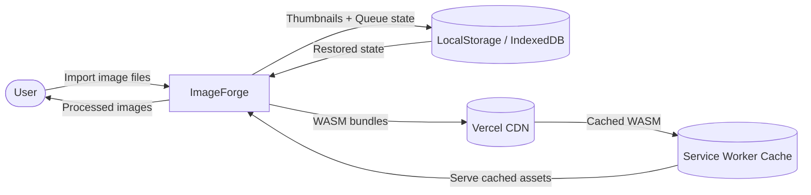
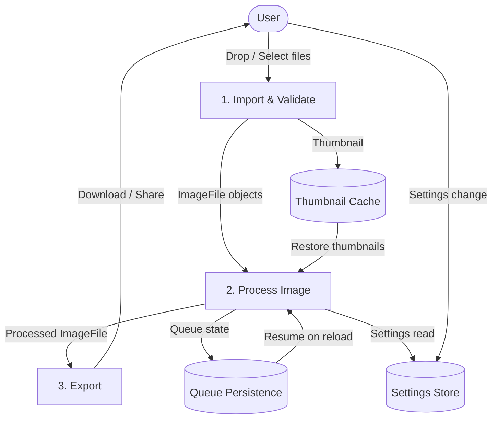
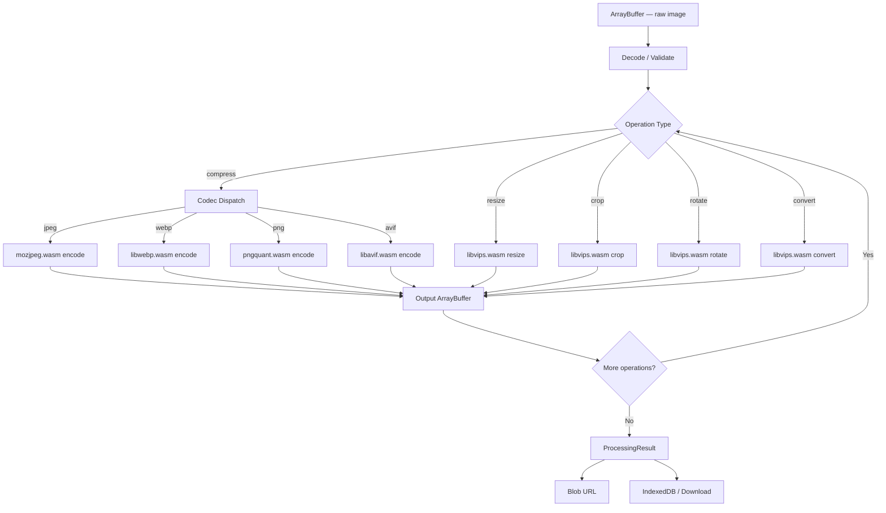

# Data Flow Diagrams

> **Document ID**: 45
> **Phase**: 2 — Architecture
> **Status**: Approved
> **Last Updated**: 2026-07-27
> **Owner**: Architecture Team

---

## Purpose

This document provides data flow diagrams (DFDs) showing how data moves through ImageForge — from the user's file system to the processed output, across all system components.

---

## Level 0 — Context Diagram



---

## Level 1 — Major Processes



---

## Level 2 — Image Processing Pipeline (Detailed)



---

## Level 2 — State Data Flow

```mermaid
graph LR
    subgraph "Zustand Stores"
        IS[imageStore]
        QS[queueStore]
        HS[historyStore]
        SS[settingsStore]
        US[uiStore]
    end

    subgraph "Mutations (TanStack)"
        CM[compressMutation]
        RM[resizeMutation]
        BM[batchMutation]
    end

    UI[React Components] -->|dispatch actions| IS
    UI --> QS
    UI --> SS

    IS -->|reactive| UI
    QS -->|reactive| UI
    US -->|reactive| UI

    UI -->|mutate()| CM
    UI -->|mutate()| RM
    UI -->|mutate()| BM

    CM -->|onSuccess → push history| HS
    RM -->|onSuccess → push history| HS
    CM -->|onSuccess → update image| IS
    RM -->|onSuccess → update image| IS

    SS -->|persist| LS[(localStorage)]
    LS -->|hydrate| SS
```

---

## Data Transformation Pipeline

```
User File (File API / Gallery)
  └→ ArrayBuffer (file.arrayBuffer())
       └→ MagicBytes check (first 16 bytes)
            └→ ExifParser (metadata extraction)
                 └→ ThumbnailGenerator (→ IndexedDB)
                      └→ ImageFile {id, buffer, meta}
                           └→ ProcessingEngine input
                                └→ Encoded ArrayBuffer
                                     └→ Blob (URL.createObjectURL)
                                          └→ 
                                               └→ User clicks Download
                                                    └→ <a download> click
                                                         └→ File saved to disk
```

---

## Data That Never Leaves the Device

- Original image `ArrayBuffer`
- Processing intermediate results
- EXIF data (GPS coordinates, etc.)
- Thumbnails
- Queue state

The only data that leaves the device:

- WASM module fetches (from Vercel CDN — anonymous, no image data)
- Optional: anonymous error reports (if user opted in — no image data included)

---

## Related Documents

| Document                                                     | Relationship          |
| ------------------------------------------------------------ | --------------------- |
| [43-sequence-diagrams.md](./43-sequence-diagrams.md)         | Sequence-level detail |
| [44-event-flow.md](./44-event-flow.md)                       | Event propagation     |
| [37-security-architecture.md](./37-security-architecture.md) | Privacy guarantees    |

---

_Document Owner: Architecture Team | Approved: 2026-07-27_
