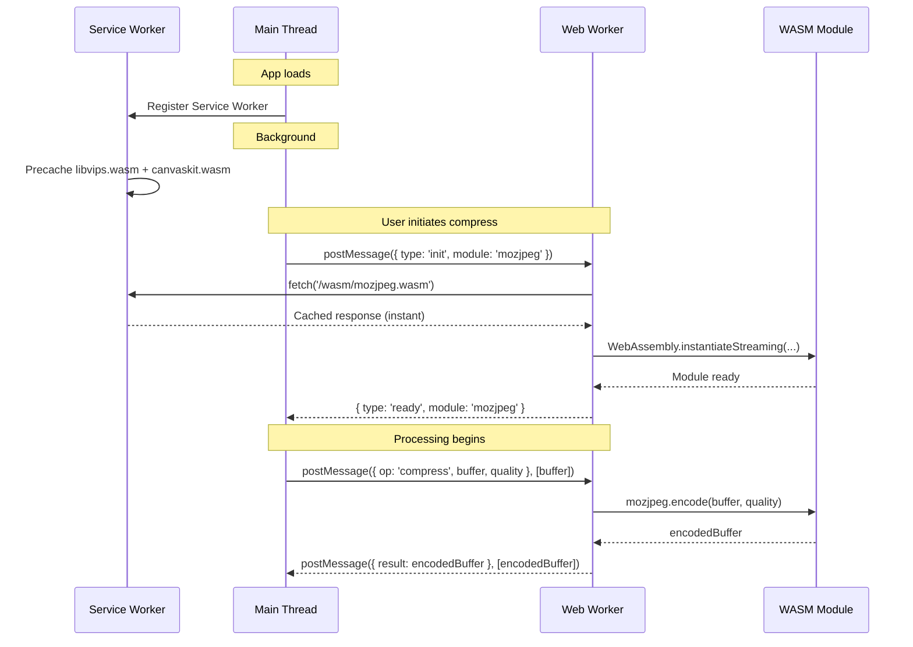

# WASM Architecture

> **Document ID**: 49b
> **Phase**: 2 — Architecture
> **Status**: Approved
> **Last Updated**: 2026-07-27
> **Owner**: Architecture Team

---

## Purpose

This document details the WebAssembly (WASM) architecture for ImageForge's web platform — how WASM modules are compiled, loaded, initialized, used for image processing, and cached.

---

## Why WebAssembly?

WebAssembly enables running C/C++ image processing libraries (libvips, mozjpeg, FFmpeg) in the browser at near-native speed:

| Technology          | Speed vs Native | Feature Richness | Privacy |
| ------------------- | --------------- | ---------------- | ------- |
| Canvas API          | 100% (GPU)      | Low              | ✅      |
| Jimp (pure JS)      | ~5–10%          | Medium           | ✅      |
| WASM (libvips)      | ~60–80%         | Full             | ✅      |
| Server-side (sharp) | 100%            | Full             | ❌      |

WASM is the only technology satisfying all three requirements simultaneously.

---

## WASM Module Inventory

| Module           | Source Library | Purpose                             | Size (gz) | Load Trigger      |
| ---------------- | -------------- | ----------------------------------- | --------- | ----------------- |
| `libvips.wasm`   | libvips 8.x    | Decode, resize, crop, rotate, color | ~3.5MB    | App start         |
| `mozjpeg.wasm`   | mozjpeg 4.x    | JPEG encoding                       | ~300KB    | First JPEG op     |
| `pngquant.wasm`  | pngquant 2.x   | PNG lossless compress               | ~200KB    | First PNG op      |
| `libwebp.wasm`   | libwebp 1.x    | WebP encode/decode                  | ~400KB    | First WebP op     |
| `libavif.wasm`   | libavif 1.x    | AVIF encode/decode                  | ~600KB    | First AVIF op     |
| `libheif.wasm`   | libheif 1.x    | HEIC/HEIF decode                    | ~800KB    | First HEIC import |
| `ffmpeg.wasm`    | FFmpeg 6.x     | GIF creation, video                 | ~7MB      | GIF module open   |
| `canvaskit.wasm` | Skia           | Canvas rendering                    | ~3MB      | App start         |
| `tesseract.wasm` | Tesseract 5    | OCR                                 | ~10MB     | OCR module open   |

---

## WASM Loading Architecture



### Key Points

1. **Transferable objects**: `ArrayBuffer` is transferred (zero-copy) between threads using the `transfer` argument of `postMessage`
2. **Streaming compilation**: `WebAssembly.instantiateStreaming` compiles while downloading for faster initialization
3. **SharedArrayBuffer**: Used for libvips processing (multi-threaded WASM) — requires COOP/COEP headers

---

## Worker Pool Architecture

```typescript
// packages/image-core/src/engines/wasm/WasmWorkerPool.ts

class WasmWorkerPool {
  private workers: WasmWorker[] = [];
  private queue: ProcessingTask[] = [];
  private readonly maxWorkers: number;

  constructor() {
    this.maxWorkers = Math.min(4, navigator.hardwareConcurrency || 2);
    this.initializeWorkers();
  }

  private initializeWorkers() {
    for (let i = 0; i < this.maxWorkers; i++) {
      const worker = new Worker(new URL('./wasm.worker.ts', import.meta.url), { type: 'module' });
      this.workers.push(new WasmWorker(worker));
    }
  }

  async dispatch(task: ProcessingTask): Promise<ProcessingResult> {
    const worker = await this.getIdleWorker();
    return worker.execute(task);
  }

  private async getIdleWorker(): Promise<WasmWorker> {
    // Wait for an idle worker
    return new Promise((resolve) => {
      const check = () => {
        const idle = this.workers.find((w) => !w.busy);
        if (idle) resolve(idle);
        else setTimeout(check, 16); // Check each frame
      };
      check();
    });
  }
}
```

---

## WASM SIMD Support

libvips and mozjpeg support WASM SIMD (Single Instruction, Multiple Data), providing 3–5× speedup on supported browsers:

```typescript
// Detect SIMD support at runtime
async function supportsWasmSimd(): Promise<boolean> {
  try {
    // Minimal SIMD test module (128-byte WASM)
    const simdTest = new Uint8Array([0,97,115,109,...]);
    await WebAssembly.instantiate(simdTest);
    return true;
  } catch {
    return false;
  }
}

// Load appropriate WASM binary
const wasmFile = (await supportsWasmSimd())
  ? '/wasm/libvips-simd.wasm'
  : '/wasm/libvips.wasm';
```

---

## Required HTTP Headers

For SharedArrayBuffer support (libvips multi-threaded mode), the following headers are required on all responses:

```
Cross-Origin-Opener-Policy: same-origin
Cross-Origin-Embedder-Policy: require-corp
```

In `vercel.json`:

```json
{
  "headers": [
    {
      "source": "/(.*)",
      "headers": [
        { "key": "Cross-Origin-Opener-Policy", "value": "same-origin" },
        { "key": "Cross-Origin-Embedder-Policy", "value": "require-corp" }
      ]
    }
  ]
}
```

---

## Memory Management

WASM has a linear memory model. Key risks:

- Memory leaks: Allocating buffers in WASM heap without freeing
- OOM: Processing multiple large images without releasing

```typescript
// Every WASM call must explicit free
async function compressJpeg(input: ArrayBuffer, quality: number): Promise<ArrayBuffer> {
  let inputPtr: number | undefined;
  let outputPtr: number | undefined;

  try {
    inputPtr = mozjpeg._malloc(input.byteLength);
    mozjpeg.HEAP8.set(new Uint8Array(input), inputPtr);

    outputPtr = mozjpeg._encode(inputPtr, input.byteLength, quality);
    const result = copyBufferFromHeap(outputPtr);

    return result;
  } finally {
    if (inputPtr) mozjpeg._free(inputPtr);
    if (outputPtr) mozjpeg._free(outputPtr);
  }
}
```

---

## Fallback Strategy

If WASM initialization fails (unsupported browser, CSP block):

1. Show "Limited Mode" banner
2. Fall back to Canvas API for: crop, rotate, flip, resize (basic quality)
3. Disable: JPEG quality control, PNG lossless, WebP/AVIF encoding
4. Suggest upgrading browser or using the mobile app

---

## Related Documents

| Document                                                             | Relationship               |
| -------------------------------------------------------------------- | -------------------------- |
| [ADR-0004](./adr/ADR-0004-image-library.md)                          | Library selection decision |
| [ADR-0007](./adr/ADR-0007-wasm-strategy.md)                          | WASM loading strategy      |
| [29-image-processing-pipeline.md](./29-image-processing-pipeline.md) | Pipeline using WASM        |
| [32-background-job-system.md](./32-background-job-system.md)         | Worker pool system         |
| [48-browser-compatibility.md](./48-browser-compatibility.md)         | Browser WASM support       |

---

_Document Owner: Architecture Team | Approved: 2026-07-27_
