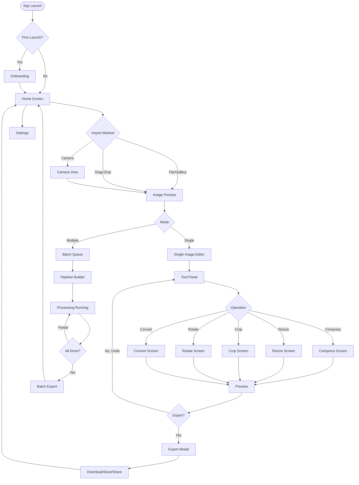

# Screen Flow

> **Document ID**: 53
> **Phase**: 3 — UI/UX Design
> **Status**: Approved
> **Last Updated**: 2026-07-27
> **Owner**: Design Team

---

## Purpose

This document maps all screens in ImageForge, their entry points, transitions, and relationships.

---

## Screen Inventory

### Core Screens (All Platforms)

| Screen              | Route                 | Primary Entry  | Mobile | Web |
| ------------------- | --------------------- | -------------- | ------ | --- |
| Home / Import       | `/`                   | App launch     | ✅     | ✅  |
| Single Image Editor | `/edit/[id]`          | Image tap      | ✅     | ✅  |
| Compress            | `/edit/[id]/compress` | Edit tab       | ✅     | ✅  |
| Resize              | `/edit/[id]/resize`   | Edit tab       | ✅     | ✅  |
| Crop                | `/edit/[id]/crop`     | Edit tab       | ✅     | ✅  |
| Rotate/Flip         | `/edit/[id]/rotate`   | Edit tab       | ✅     | ✅  |
| Format Convert      | `/edit/[id]/convert`  | Edit tab       | ✅     | ✅  |
| Batch Queue         | `/batch`              | Tab bar        | ✅     | ✅  |
| Pipeline Builder    | `/batch/pipeline`     | Batch screen   | ✅     | ✅  |
| Export              | `/_modals/export`     | Export button  | ✅     | ✅  |
| History             | `/_modals/history`    | History button | ✅     | ✅  |
| Settings            | `/settings`           | Tab bar        | ✅     | ✅  |

### Phase 2+ Screens

| Screen             | Route                  | Phase |
| ------------------ | ---------------------- | ----- |
| Enhance            | `/edit/[id]/enhance`   | P2    |
| Filters            | `/edit/[id]/filters`   | P2    |
| Watermark          | `/edit/[id]/watermark` | P2    |
| Drawing            | `/edit/[id]/draw`      | P2    |
| Blur               | `/edit/[id]/blur`      | P2    |
| GIF Creator        | `/gif`                 | P3    |
| PDF Tools          | `/pdf`                 | P3    |
| OCR                | `/ocr`                 | P3    |
| Background Removal | `/edit/[id]/bg-remove` | P3    |

---

## Screen Flow Diagram

---

## Key Screen Descriptions

### Home Screen

- **Purpose**: Import images and navigate to features
- **Components**: HeroDropZone (web), ImportButtons, RecentImages, FeatureGrid
- **Entry points**: App launch, after export

### Single Image Editor

- **Purpose**: Apply one or more operations to a single image
- **Components**: ImagePreview, ToolPanel, OperationControls, HistoryPanel
- **Layout**: Split-pane (preview left, controls right on web; stacked on mobile)

### Batch Queue

- **Purpose**: Manage and process multiple images with a pipeline
- **Components**: QueueList, PipelineBuilder, ProgressBar, BatchControls
- **Key actions**: Pause, Resume, Cancel, Retry, Export All

### Export Modal

- **Purpose**: Configure and trigger export
- **Components**: FormatSelector, QualitySlider, FileNamingTemplate, ExportButton
- **Platforms**: Web = Download button / Clipboard; Mobile = Save to Photos / Share Sheet

---

## Related Documents

| Document                                             | Relationship          |
| ---------------------------------------------------- | --------------------- |
| [52-navigation.md](./52-navigation.md)               | Navigation structure  |
| [54-user-flow.md](./54-user-flow.md)                 | User journey maps     |
| [51-component-library.md](./51-component-library.md) | Components per screen |

---

_Document Owner: Design Team | Approved: 2026-07-27_
