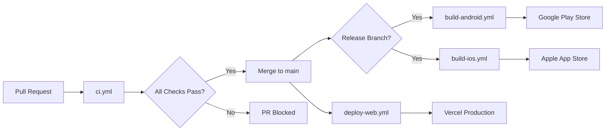

# CI/CD Pipeline

> **Document ID**: 80
> **Phase**: 6 — DevOps & Infrastructure
> **Status**: Approved
> **Last Updated**: 2026-07-27
> **Owner**: DevOps / Architecture Team

---

## Purpose

This document defines the complete CI/CD pipeline for ImageForge — all GitHub Actions workflows, build configurations, deployment processes, and quality gates.

---

## Pipeline Overview



---

## Workflow: `ci.yml` (Pull Request)

Runs on every PR. All jobs must pass before merge is allowed.

```yaml
# .github/workflows/ci.yml
name: CI

on:
  pull_request:
    branches: [main, develop]
  push:
    branches: [main]

jobs:
  lint:
    name: Lint & Format
    runs-on: ubuntu-latest
    steps:
      - uses: actions/checkout@v4
      - uses: actions/setup-node@v4
        with:
          node-version: '20'
          cache: 'pnpm'
      - run: pnpm install --frozen-lockfile
      - run: pnpm lint
      - run: pnpm format:check

  typecheck:
    name: TypeScript
    runs-on: ubuntu-latest
    needs: [lint]
    steps:
      - uses: actions/checkout@v4
      - uses: actions/setup-node@v4
        with:
          node-version: '20'
          cache: 'pnpm'
      - run: pnpm install --frozen-lockfile
      - run: pnpm typecheck

  test:
    name: Unit Tests
    runs-on: ubuntu-latest
    needs: [typecheck]
    steps:
      - uses: actions/checkout@v4
      - uses: actions/setup-node@v4
        with:
          node-version: '20'
          cache: 'pnpm'
      - run: pnpm install --frozen-lockfile
      - run: pnpm test --coverage
      - uses: actions/upload-artifact@v4
        with:
          name: coverage
          path: coverage/
      - name: Coverage gate
        run: |
          COVERAGE=$(cat coverage/coverage-summary.json | jq '.total.lines.pct')
          if (( $(echo "$COVERAGE < 80" | bc -l) )); then
            echo "Coverage $COVERAGE% is below 80% threshold"
            exit 1
          fi

  build-web:
    name: Build Web
    runs-on: ubuntu-latest
    needs: [test]
    steps:
      - uses: actions/checkout@v4
      - uses: actions/setup-node@v4
        with:
          node-version: '20'
          cache: 'pnpm'
      - run: pnpm install --frozen-lockfile
      - run: pnpm build
        env:
          TURBO_TOKEN: ${{ secrets.TURBO_TOKEN }}
          TURBO_TEAM: ${{ vars.TURBO_TEAM }}

  lighthouse:
    name: Lighthouse CI
    runs-on: ubuntu-latest
    needs: [build-web]
    steps:
      - uses: actions/checkout@v4
      - run: pnpm install --frozen-lockfile
      - run: pnpm lhci autorun
        env:
          LHCI_GITHUB_APP_TOKEN: ${{ secrets.LHCI_TOKEN }}

  e2e:
    name: E2E Tests
    runs-on: ubuntu-latest
    needs: [build-web]
    steps:
      - uses: actions/checkout@v4
      - run: pnpm install --frozen-lockfile
      - run: npx playwright install --with-deps chromium
      - run: pnpm e2e

  security:
    name: Security Audit
    runs-on: ubuntu-latest
    steps:
      - uses: actions/checkout@v4
      - run: pnpm install --frozen-lockfile
      - run: npm audit --audit-level=high
      - run: pnpm license-check
```

---

## Workflow: `deploy-web.yml` (Auto-Deploy)

```yaml
# .github/workflows/deploy-web.yml
name: Deploy Web

on:
  push:
    branches: [main]

jobs:
  deploy:
    runs-on: ubuntu-latest
    steps:
      - uses: actions/checkout@v4
      - uses: amondnet/vercel-action@v25
        with:
          vercel-token: ${{ secrets.VERCEL_TOKEN }}
          vercel-org-id: ${{ secrets.ORG_ID }}
          vercel-project-id: ${{ secrets.PROJECT_ID }}
          vercel-args: '--prod'
```

---

## Workflow: `build-android.yml` (EAS Build)

```yaml
# .github/workflows/build-android.yml
name: Build Android

on:
  push:
    branches: [release/*]

jobs:
  build:
    runs-on: ubuntu-latest
    steps:
      - uses: actions/checkout@v4
      - uses: expo/expo-github-action@v8
        with:
          eas-version: latest
          token: ${{ secrets.EXPO_TOKEN }}
      - run: cd apps/mobile && eas build --platform android --profile production
```

---

## Quality Gates Summary

| Gate                     | Threshold       | Tool          |
| ------------------------ | --------------- | ------------- |
| Lint                     | 0 errors        | ESLint        |
| TypeScript               | 0 errors        | tsc           |
| Unit test coverage       | ≥ 80%           | Vitest        |
| Lighthouse Performance   | ≥ 85            | Lighthouse CI |
| Lighthouse Accessibility | ≥ 90            | Lighthouse CI |
| Security audit           | 0 high/critical | npm audit     |
| E2E tests                | All pass        | Playwright    |
| Bundle size              | ≤ 500KB JS      | bundlesize    |

---

## Vercel Configuration

```json
// vercel.json
{
  "framework": "vite",
  "buildCommand": "turbo run build --filter=apps/web",
  "outputDirectory": "apps/web/dist",
  "headers": [
    {
      "source": "/(.*)",
      "headers": [
        { "key": "Cross-Origin-Opener-Policy", "value": "same-origin" },
        { "key": "Cross-Origin-Embedder-Policy", "value": "require-corp" },
        { "key": "X-Content-Type-Options", "value": "nosniff" },
        { "key": "X-Frame-Options", "value": "SAMEORIGIN" },
        { "key": "Referrer-Policy", "value": "strict-origin-when-cross-origin" }
      ]
    },
    {
      "source": "/wasm/(.*)",
      "headers": [{ "key": "Cache-Control", "value": "public, max-age=31536000, immutable" }]
    }
  ]
}
```

---

## Related Documents

| Document                                                     | Relationship             |
| ------------------------------------------------------------ | ------------------------ |
| [25-monorepo-architecture.md](./25-monorepo-architecture.md) | Turborepo build pipeline |
| [37-security-architecture.md](./37-security-architecture.md) | Security headers         |
| [36-performance-strategy.md](./36-performance-strategy.md)   | Lighthouse thresholds    |

---

_Document Owner: DevOps Team | Approved: 2026-07-27_
